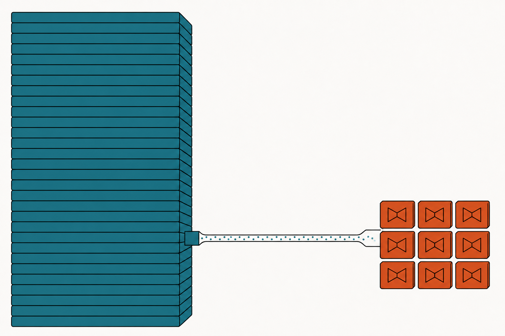
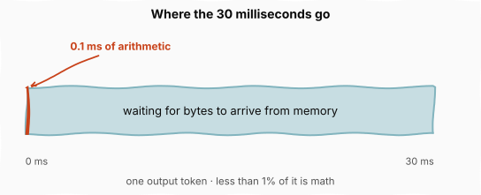
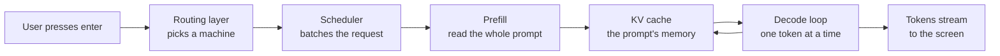
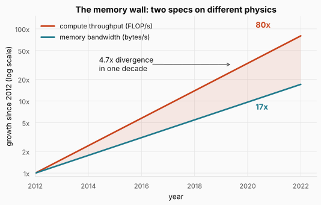
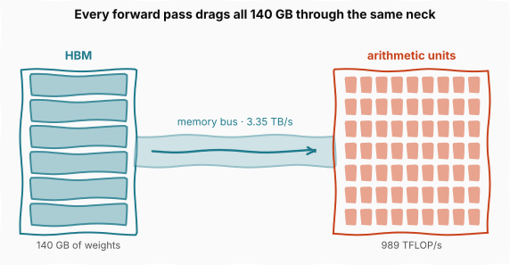
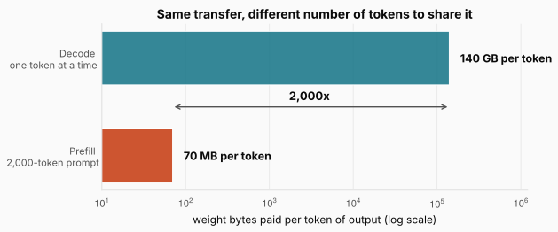
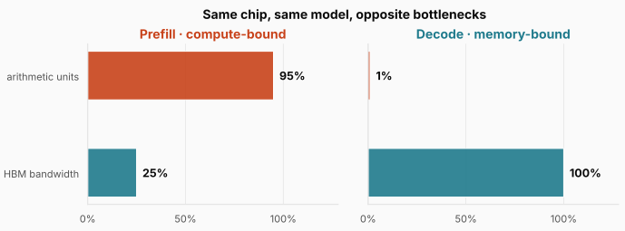
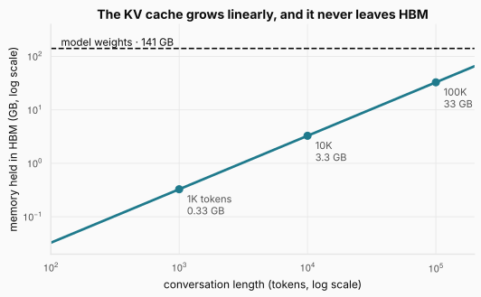
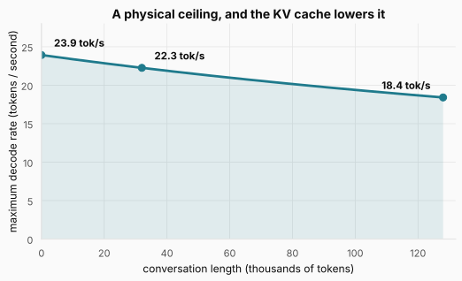

# The Memory Wall: Where the 30 Milliseconds Actually Go

> **The throughline:** _Arithmetic is cheap. Moving bytes is expensive. Every technique in this series is a way of buying back bandwidth._
> This is the first post in a series on LLM inference, the engineering that sits between a model checkpoint and a chat window. It is built from [The Engineering Behind LLM Inference: The Memory Wall](https://www.youtube.com/watch?v=ENkuf_2zbkc), with the numbers re-derived and the figures redrawn.

## 1. The intuition

Start with a number that does not add up.

A modern AI accelerator performs roughly a quadrillion arithmetic operations per second. That is $10^{15}$, a trillion operations in every millisecond. Producing one output token from a frontier language model takes around a hundred billion operations, $10^{11}$. Divide one by the other and the math inside a single token should take about **a tenth of a millisecond**.

In production, that token takes **30 milliseconds**.

The chip had time to finish the arithmetic for three hundred more tokens and it did not. Less than 1 percent of that window went to arithmetic. Something else consumed the other 99 percent.

The figure draws that budget to scale, and the honest version is almost comical: the terracotta sliver at the left edge is all the math. Everything else is the chip waiting. Hold on to this picture, because the whole post is an explanation of the teal region. **The gap between what the arithmetic implies and what the hardware delivers is the central question of LLM inference.**

Before we open it up, it helps to know what "inference" refers to. Training produces a checkpoint, a large file of numbers. Inference is everything required to turn that file into a service that answers people. Requests arrive at a routing layer that picks a machine. A scheduler batches your request alongside thousands of others. A memory manager decides which weights live on which chip. Kernels perform the actual arithmetic, and an orchestration layer wires it together.

That diagram is the map for the whole series, and this post covers the two boxes in the middle. Prefill and decode are where the 30 milliseconds are spent, and the loop drawn from decode back to the KV cache is the reason decode behaves so differently from prefill. Every other box exists to keep those two fed.

This is worth caring about because of where the money goes. Deloitte projects inference will account for roughly two thirds of all AI compute in 2026, the five largest US hyperscalers have guided to combined AI capital expenditure in the $700 billion range this year, and OpenAI's API alone processes more than 20 trillion tokens a day. At that volume every architectural decision, from chip layout to scheduling policy, collapses into one number: cost per token.

By the end of this post you will be able to derive those 30 milliseconds from two hardware specs and one model, for any model on any chip.

## 2. The math you need

### 2.1 An accelerator is really just two numbers

To explain the 99 percent we need to look at what a chip can actually do, and there are only two capabilities that matter.

**Compute throughput** is how fast the chip does arithmetic, measured in floating-point operations per second (FLOP/s). Call it $C$.

**Memory bandwidth** is how fast it can move data between its off-chip memory and its arithmetic units, measured in bytes per second. Call it $B$.

Producing a token needs both. The chip has to fetch weights from memory, then multiply them against the input. If either channel is too slow, the other one sits idle. That is the entire story in one sentence, and the rest of this post is about which one is too slow.

Here is the part that makes inference hard: these two specs scale on completely different physics.

Compute throughput tracks transistor density, which is how many arithmetic units you can fit on a chip. That number has grown exponentially for decades and has not hit a hard ceiling yet.

Memory bandwidth is the product of three separate things: how fast you can signal across each pin on the package, how many pins each memory stack uses, and how many memory stacks you can physically fit around the chip. Every one of those three has its own hard physical limit. You cannot signal faster than the electrical properties of the link allow, you cannot add pins to a fixed package edge forever, and you cannot fit more stacks around a die than geometry permits.

The figure shows what that difference in physics produced over one decade of top-tier server GPUs. Between 2012 and 2022 floating-point throughput grew by a factor of about 80. Over the same period, off-chip memory bandwidth on those same GPUs grew by a factor of about 17. The shaded wedge between the curves is a 4.7x divergence in ten years, and because both axes are logarithmic, that wedge widening means the ratio itself is still growing.

Computer architects have a name for this. Wulf and McKee called it the **memory wall** in their 1995 paper _Hitting the Memory Wall: Implications of the Obvious_, more than twenty years before the transformer existed. The gap is built into the physics and it is not closing.

What is new is the workload. Large language model inference is among the most byte-hungry computations ever built to run on this hardware, so a concern that architects have always managed has become the dominant one. **On a modern accelerator, arithmetic is cheap and data movement is expensive, and every technique in the rest of this series takes that asymmetry as given.**

<strong>Check:</strong> Why can't chip designers simply widen the memory bus until bandwidth catches up with compute?

**Answer.** Bandwidth is the product of per-pin signaling rate, pins per memory stack, and number of stacks around the die. Each term has a physical ceiling: signaling is limited by the electrical behavior of the link, pin count by the package edge available, and stack count by the physical area around the chip. Compute, by contrast, scales with transistor density, which has kept shrinking. You can buy some bandwidth back with better packaging, but not exponentially, and not on the schedule compute has been improving.

### 2.2 What one forward pass actually moves

We know arithmetic is cheap and bytes are expensive. To see where that bites, we need to know how many bytes a language model actually moves, and that follows from the structure of a transformer.

A language model takes text and produces the next token. Tokens are the units of text the model works with, a little smaller than words on average, so a 500-word prompt is usually 600 to 800 tokens. Each token is mapped to a vector, a fixed-length list of numbers several thousand wide, encoding both the token's identity and its position in the sequence.

Those vectors pass through a stack of repeated processing units called transformer layers. A large model has anywhere from 60 to over 100 of them, and every layer performs two operations in order.

The first is **attention**. Each token's vector is projected into three separate vectors: a query, a key, and a value. The query captures what this token is looking for, the key captures what it can offer to other tokens, and the value is what it contributes when matched. The model compares every query against every key to get similarity scores, then uses those scores to blend the values into an updated vector for each position. This is how context travels between tokens.

The second is the **feed-forward network**. Each token's vector, independently of the others, is multiplied through two large weight matrices with a non-linear function between them. This is where the model applies what it learned during training, transforming each token's representation without reference to its neighbors.

The output of one layer is the input to the next. After the last layer, the model takes the final vector at the last position, multiplies it against a vocabulary projection matrix that scores every possible next token, and picks one. That whole trip is **one forward pass**.

> **Want the architecture in more depth?** This section compresses a large topic down to the parts the bandwidth argument needs. If you would rather build these components than read about them, I wrote a book that does exactly that: [My Adventures with Large Language Models](https://leanpub.com/adventures-with-llms) goes from a vanilla Transformer up through GPT-2, Llama 3, and DeepSeek in PyTorch, loading real pretrained weights at each step to check your implementation. Chapter 4 builds the KV cache and grouped-query attention, which are the two ideas Section 2.7 leans on hardest.

Now the one feature of this architecture that dominates everything else. Every layer is parameterized by weight matrices: the ones producing queries, keys, and values, the one combining the attention output, and two more in the feed-forward network. Those weights are what the model learned. They _are_ the model.

For a 70 billion parameter model stored at 16-bit precision, that is 2 bytes per weight times 70 billion weights:

$$W = 70 \times 10^{9} \text{ weights} \times 2 \text{ bytes} = 140 \text{ GB}$$

Read it plainly: $W$ is the total size of the model's weights in bytes, the parameter count multiplied by the bytes used to store each one. Interpreting it: at 16-bit precision a 70B model occupies 140 GB, and if you halved the precision to 8 bits you would halve this number. That last observation is the seed of an entire family of techniques we will get to later in the series.

These weights live in the chip's off-chip memory pool, generally **HBM** (high-bandwidth memory), a stack of silicon memory chips bonded next to the GPU die on the same package and connected by a wide parallel bus.

The figure is drawn deliberately out of proportion to make one point. The two blocks are large and the bus between them is a thin neck. Every time the model runs a forward pass, all 140 GB of weights must be read out of HBM and pushed through that neck into the arithmetic units. The weights do not change between requests, and they are not reduced or summarized on the way. **Every forward pass drags the entire model across the memory bus.**

### 2.3 Two phases, opposite economics

Every forward pass moves the same 140 GB. What changes is how much useful work it gets done on the way, and that depends on which of two phases the model is in.

When you send a prompt, the system processes it in two stages. They run on the same chip, use the same weights, and share the same forward pass code, but their resource profiles are opposites.

**Prefill** takes the entire prompt at once and processes every token simultaneously through every layer. When it finishes, the model has a representation for every position and is ready to generate.

That word "simultaneously" is carrying a lot of weight, so it is worth unpacking now rather than later.

The reason prefill can handle 2,000 tokens at once is that **inside a single layer, the positions do not depend on each other.** Look again at the two operations. The feed-forward network applies the same two weight matrices to each token's vector separately, with no reference to its neighbors, so 2,000 tokens is one matrix multiplication with 2,000 rows rather than 2,000 separate multiplications. Attention does mix positions, but during prefill it only mixes positions that already exist: the whole prompt is known before we start, so all 2,000 queries, keys, and values come out of one multiplication, and all the pairwise scores out of one more. Causal masking then zeroes the entries where a token would have looked forward, which is cheaper than avoiding them.

So the sequential dependency in a transformer runs down the layers, not across the positions. Layer 12 genuinely needs layer 11's output and that ordering cannot be broken. But within layer 12, all 2,000 positions are computed together. **Depth is sequential, width is parallel**, and a prompt hands you 2,000 tokens of width for free.

**Decode** produces output tokens one at a time. To generate the first output token the model runs a full forward pass and samples from the result. To generate the second it runs another complete forward pass. The third needs a third, and so on until the model emits a stop signal or hits a length limit. Every single output token pays for its own full trip through the entire model.

Decode cannot borrow prefill's trick because its width is one. The token at position $t$ does not exist until the model has produced the token at $t-1$, so there is nothing to place alongside it in the matrix. Section 2.7 works through exactly what that costs and the data structure the field uses to survive it.

Now apply the asymmetry. In prefill, the model loads each layer's weights once and that single transfer serves arithmetic on every token in the prompt at the same time. In decode, the model loads the exact same weights and moves the exact same number of bytes, but all of it serves one token of output.

The cleanest way to see the difference is to divide the transfer by the tokens that share it:

$$\text{weight bytes per token} = \frac{W}{T_{\text{shared}}}$$

Read it symbol by symbol: the left side is how many bytes of weight traffic each output token is charged for, $W$ is the 140 GB weight footprint from the previous section, and $T_{\text{shared}}$ is the number of tokens processed in that one pass. Interpreting it: the numerator is fixed by the model, so the only way to lower the per-token cost is to raise the denominator. More tokens per pass, cheaper tokens.

Put the two phases in. For a 2,000-token prompt, prefill divides 140 GB across 2,000 tokens and pays about 70 MB per token. Decode divides 140 GB across exactly one token and pays all 140 GB.

The figure puts both on one logarithmic axis, and the gap is three orders of magnitude wide. Prefill is terracotta and decode is teal because, as the next section will make precise, they end up limited by different halves of the chip. The memory bus pays exactly the same toll in both phases. The payoff from that toll differs by a factor of two thousand.

A natural first guess is that decode is slow because the model is large. That guess is correct in a way that misses the point. The model is exactly the same size in both phases and the bytes moved per forward pass are identical. **What changes is how much useful computation those transferred bytes perform, and decode has no other tokens to share the cost with.**

<strong>Check:</strong> Prefill and decode run the same code on the same weights. So why does only one of them keep the arithmetic units busy?

**Answer.** Because "busy" depends on how much math each loaded byte enables. Prefill has thousands of prompt tokens waiting on the same weight matrix, so one transfer feeds thousands of multiply-accumulate operations and the math units always have work queued. Decode has exactly one token, so the same transfer feeds one token's worth of math, and the units finish almost immediately and then wait for the next weight matrix to arrive.

### 2.4 Arithmetic intensity, the number that predicts the bottleneck

We now have a per-phase cost in bytes. To turn that into a prediction about which part of the chip runs out first, the field uses one piece of vocabulary.

**Arithmetic intensity** measures how much work a chip gets out of each byte it drags from memory:

$$I = \frac{\text{arithmetic operations performed}}{\text{bytes moved between memory and compute}}$$

Read it: the numerator counts every multiply and add the workload performs, the denominator counts every byte that crosses between off-chip memory and the on-die arithmetic units, and $I$ is their ratio in operations per byte. Interpreting it: a workload with high $I$ reuses each loaded byte many times before discarding it, while a workload with low $I$ loads a byte, does almost nothing with it, and immediately needs another. The point of the metric is that it tells you _in advance_ whether a workload will be limited by the chip's ability to do math or by its ability to deliver bytes.

We can compute $I$ for both phases from numbers we already have. A transformer does roughly 2 floating-point operations per parameter per token (one multiply and one add in the dominant matrix multiplications), so a forward pass over $T$ tokens performs about $2NT$ operations for a model with $N$ parameters.

For prefill on a 2,000-token prompt: $2 \times 70\text{B} \times 2{,}000 \approx 280$ TFLOPs, and about 290 TFLOPs once attention is counted. It moves the 140 GB of weights plus a few GB of activations and cache writes, call it 146 GB. That gives roughly 2,000 operations per byte.

For decode of one token: $2 \times 70\text{B} \times 1 = 140$ GFLOPs against the same 140 GB of weights. That gives 1 operation per byte.

**Prefill extracts about two thousand operations from every byte it moves. Decode extracts one.**

### 2.5 The roofline

Arithmetic intensity tells us about the workload. To turn it into a performance prediction we need one more thing: a model of the chip. There is a single diagram that does this, introduced in 2009 by Samuel Williams, Andrew Waterman, and David Patterson at Berkeley.

The **roofline** says achievable performance is capped by two ceilings at once, and you get whichever is lower:

$$P(I) = \min\big(C,\; B \cdot I\big)$$

Read it symbol by symbol: $P$ is the performance you can actually achieve in operations per second, $C$ is the chip's peak compute throughput in FLOP/s, $B$ is its memory bandwidth in bytes per second, and $I$ is the workload's arithmetic intensity in operations per byte. The term $B \cdot I$ has units of bytes per second times operations per byte, which is operations per second, so both arguments of the $\min$ are comparable. Interpreting it: the first ceiling is flat, because no matter how much data reuse you achieve, the arithmetic units have a maximum rate. The second ceiling is slanted, because if you only get $I$ operations out of each byte and bytes arrive at $B$ per second, you can only sustain $B \cdot I$ operations per second. Raising $I$ raises the slanted ceiling until it meets the flat one, and after that it buys you nothing. Both ceilings and the point where they cross are drawn in the figure a little further down, so read the next two paragraphs with that shape in mind.

The point where the two ceilings meet has a name. Setting $C = B \cdot I$ and solving:

$$I_{\text{ridge}} = \frac{C}{B}$$

Read it: the ridge is the chip's peak compute divided by its bandwidth, again in operations per byte. Interpreting it: it is the break-even data reuse for that chip. Below the ridge a workload is **memory-bound**, meaning the bus is the constraint and the math units idle. Above it the workload is **compute-bound**, meaning the math units are the constraint and the bus has room to spare. Notice that the ridge is a property of the hardware alone, not of the model, which is why it is the same number for every workload you run on that chip.

Plug in a real accelerator. An NVIDIA H100 SXM peaks at 989 trillion 16-bit floating-point operations per second, and its HBM3 bandwidth is 3.35 trillion bytes per second. Dividing one by the other puts the ridge at roughly 295 operations per byte, and we already know from the previous section that prefill sits near 2,000 and decode at 1.

That is everything the diagram needs.

The figure places both phases on the same diagram, and the separation is the whole argument of this post made visible. The flat terracotta line is the compute ceiling and the slanted teal line is the bandwidth ceiling, meeting at the ridge. Prefill sits on the flat ceiling, seven times to the right of the ridge, where the arithmetic units are saturated and the memory bus has bandwidth to spare. Decode sits deep on the slanted ceiling, nearly 300 times to the left, where HBM is saturated and the arithmetic units are nearly idle. Same chip, same model, same code, opposite sides of the diagram.

The roofline is a simplification. It assumes a single level of memory, ignores caching, ignores kernel launch latency, and treats every operation as perfectly pipelined. As a first-order diagnostic for whether a workload will starve the math units or the memory bus, it has held up remarkably well since 2009.

The figure translates the roofline positions into what you would see on a profiler. During prefill the tensor cores run near 95 percent while the memory bus is only a quarter busy. During decode those numbers invert almost perfectly: the bus is pinned at 100 percent while the arithmetic units sit near 1 percent. **This is the structural answer to where the 30 milliseconds went. The chip spends 99 percent of every decode step waiting for bytes to arrive, and it does so while functioning exactly as designed.**

<strong>Check:</strong> Two chips have the same peak FLOP/s, but chip B has double the memory bandwidth. What happens to the ridge, and which workloads benefit?

**Answer.** The ridge is peak compute divided by bandwidth, so doubling bandwidth halves the ridge. Chip B breaks even at half the data reuse, which means workloads that were just below the old ridge become compute-bound and every memory-bound workload runs up to twice as fast. Compute-bound workloads like prefill see no benefit at all, since they were never waiting on the bus.

### 2.6 The ceiling you cannot code around

Knowing decode is memory-bound is qualitative. The same two numbers give us a hard quantitative limit, and it is worth deriving because it explains why entire research directions exist.

If decode is limited purely by bandwidth, then the time to produce one token is the bytes that token requires divided by how fast bytes arrive. Invert that for a rate:

$$\text{tokens per second} = \frac{B}{\text{bytes per token}}$$

Read it: $B$ is memory bandwidth in bytes per second and the denominator is how many bytes must cross the bus to produce a single output token, so the quotient is tokens per second. Interpreting it: this is not a software estimate, it is a division. Nothing that runs on the chip can beat it, because the bytes physically have to arrive.

For our running example, 3.35 TB/s divided by 140 GB per token gives **about 24 tokens per second**, or roughly 42 milliseconds per token. No kernel optimization can exceed that on one H100 at batch size one, because the limit is just how fast the memory bus can deliver weights.

That leaves exactly three ways past it, and they map onto the rest of this series:

1. **Raise $B$.** Move to a chip with more bandwidth, or spread the model across several chips so their bandwidths add. This is why the production number is 30 milliseconds rather than 42: real deployments shard a model across multiple GPUs, and the aggregate bandwidth is what serves each token.
2. **Shrink the bytes per token.** Store the weights in fewer bits, or compress the runtime structures the model has to read. This is quantization, and it is the subject of an entire post later.
3. **Amortize the transfer across more tokens.** Batch independent requests so one weight pass serves many users, or generate more than one token per forward pass. This is batching and speculative decoding.

The first route deserves a closer look, because at first glance it should not work. We just established that a forward pass is sequential down the layers, so how does adding GPUs make a single token arrive faster?

The answer is that sharding does not parallelize the sequence. It parallelizes the weight matrices. Under **tensor parallelism**, each GPU holds a slice of every weight matrix in every layer, typically a subset of the columns. When layer 12 runs, all eight GPUs read their own slice out of their own HBM at the same time, so the time to stream that layer is $W/8$ divided by $B$ instead of $W$ divided by $B$. Depth is still strictly sequential and layer 12 still waits for layer 11, but the bytes each layer needs now arrive eight times faster. Recall the framing from Section 2.3: depth is sequential and width is parallel. A weight matrix is width.

Nothing here is free. After each sharded multiplication every GPU holds a partial result, and those have to be summed and redistributed across the group before the next operation can start. That collective communication travels over the interconnect between the chips, and it is why doubling the GPU count does not quite halve the latency, and why the technique stops paying past a certain point. We will take it apart properly later in the series.

**Every serving optimization in this series is one of those three moves.** Keep the list in mind, because from here on we will mostly be filling it in.

### 2.7 Why decode is sequential, and the cache that makes it possible

Back in Section 2.3 we said decode cannot use prefill's trick because its width is one, and deferred the consequences. This is where they land.

Recall that attention is **causal**: a token at position $t$ may attend to positions $0$ through $t$, never forward. Prefill satisfies that constraint for free, because the whole prompt already exists and every position can be computed in one go. Decode cannot, because its tokens do not exist yet. Token $t$ is not known until the model has produced it, and computing its attention output requires the keys and values of every position before it, the whole prefix of prompt plus everything generated so far.

That last requirement is the expensive part, and it raises an immediate question: where do those earlier keys and values come from on each new step?

Here is the observation that rescues this, and it is easy to miss on a first pass through the attention equations. **The keys and values for positions $0$ through $t-1$ do not depend on the token at position $t$.** They were fully determined when those earlier tokens were processed, and they do not change as new tokens arrive.

That matters because of what the alternative costs. If we recomputed them from scratch at every step, generating token 1,000 would mean recomputing keys and values for 999 prior positions through every layer. The total work to generate $n$ tokens would grow with $n^2$.

So we save them instead. Every time a token passes through a layer, the key and value it produces are written into a dedicated region of HBM. That region is the **KV cache**. To generate the next token we compute just that one token's key and value, append them, and read the full cache to compute attention. Linear work per token instead of quadratic.

This is an obvious optimization once you see it, and every modern serving system implements it. It is the reason decode is tractable at all. It is also, as we are about to see, the reason most of the remaining optimizations in this series exist.

How big does that region get? The cache holds a key vector and a value vector per token, in every layer, for every request being served at once:

$$\text{KV cache bytes} = l \times b \times n \times h \times s \times 2 \times 2$$

Read it term by term: $l$ is the number of transformer blocks, $b$ is the batch size (how many requests share the machine), $n$ is the number of key-value heads, $h$ is the size of each head, $s$ is the context length in tokens, the first 2 counts the two caches per block (one for keys, one for values), and the second 2 is the bytes per number at 16-bit precision. Interpreting it: the cache grows linearly in every one of those factors at once, and nothing in the expression saturates or tails off. Double the layers and it doubles. Double the conversation length and it doubles. Double the number of concurrent users and it doubles again.

One term deserves a warning, because it is where a first estimate usually goes wrong. **$n$ is the number of key-value heads, not the number of query heads.** In classic multi-head attention those are the same number, but modern models deliberately decouple them. Llama-3-70B has 64 query heads and only 8 key-value heads, so eight query heads share each cached key and value. That one design choice, grouped-query attention, divides this entire formula by eight.

Now put Llama-3-70B in and ask what a single token of a single conversation costs. Set $b = 1$ and $s = 1$, and build it up one factor at a time:

- 8 key-value heads of 128 dimensions gives $8 \times 128 = 1{,}024$ numbers for that token's keys in one layer
- keys and values together doubles it to $2{,}048$ numbers
- at 2 bytes each, that is $4{,}096$ bytes per layer
- across all 80 layers, $4{,}096 \times 80 = 327{,}680$ bytes

So one token costs **320 KB**, and because $s$ enters the formula linearly, a conversation is just that number multiplied out:

| Conversation length | KV cache |
| ------------------- | -------- |
| 1,000 tokens        | 0.33 GB  |
| 10,000 tokens       | 3.3 GB   |
| 100,000 tokens      | 33 GB    |

Every token of conversation costs 320 KB of permanent HBM residency, and at 100,000 tokens the cache has grown to 33 GB.

It is worth seeing what that number looks like without grouped-query attention, because it explains why the technique exists. Take a model with 61 blocks and 128 heads of size 128, and let it cache all 128 heads at a context of 100,000 tokens. The same formula gives $61 \times 1 \times 128 \times 128 \times 100{,}000 \times 2 \times 2$, which is over **400 GB** for a single conversation, comfortably more than the weights of most models you would want to run. Nobody ships that. The cache-shrinking techniques are not optimizations bolted on afterward, they are what makes long context possible at all.

The figure puts that growth next to the model's own footprint. The dashed line is the 141 GB of weights, fixed no matter what. The teal line is the cache, and by 100,000 tokens it has reached roughly a quarter of the model's own size. This is a single conversation. A production server holds hundreds at once.

And now the two halves of the post collide. The cache lives in HBM right alongside the weights, and every decode step must read every weight _and_ every cache entry up to the current position. Both draw on the same bandwidth budget, so the cache enters the bytes-per-token bill directly:

$$\text{tokens per second} = \frac{B}{W + s \cdot k_{\text{token}}}$$

Read it: $B$ is bandwidth, $W$ is the 140 GB of weights, $s$ is the current conversation length in tokens, and $k_{\text{token}}$ is the 320 KB per token we just computed. Interpreting it: the denominator now grows as the conversation goes on, so the ceiling from the last section is not a constant. It decays as the user keeps talking.

Work the worst case by hand. At a context of 128,000 tokens the cache holds $128{,}000 \times 327{,}680 = 41.9$ GB, so each decode step has to move $140 + 41.9 = 181.9$ GB rather than 140. Divide bandwidth by that and $3.35 \div 0.1819 = 18.4$ tokens per second. Repeating that division at a few lengths:

| Context         | Bytes moved per token | Ceiling      |
| --------------- | --------------------- | ------------ |
| empty           | 140.0 GB              | 23.9 tok/s   |
| 8,000 tokens    | 142.6 GB              | 23.5 tok/s   |
| 32,000 tokens   | 150.5 GB              | 22.3 tok/s   |
| 128,000 tokens  | 181.9 GB              | 18.4 tok/s   |

A long conversation is measurably slower than a short one, on identical hardware, for no reason other than bytes.

The figure traces that decay. At the start of a conversation the ceiling is 23.9 tokens per second. By 128,000 tokens of context it has fallen to 18.4, a 23 percent loss that no amount of kernel tuning can recover, because the extra bytes genuinely have to move. **The model and the conversation compete for the same bus, and this is the single fact that shapes every technique that comes after this post.** Some of them shrink the cache by changing how keys and values are represented. Some share it across requests with a common prefix. Some split it across machines so no single GPU holds all of it, and some refuse to materialize parts of it at all.

<strong>Check:</strong> If the KV cache saves us from quadratic recomputation, why is it described as a problem?

**Answer.** It trades compute for memory traffic, and on this hardware memory traffic is the scarce resource. The trade is still overwhelmingly worth making, since the alternative is quadratic work. But the cache then sits in HBM and has to be re-read on every decode step, so it adds to the bytes-per-token bill that already sets the throughput ceiling. It solved a compute problem by making the bandwidth problem worse.

### 2.8 What the user actually feels

Everything so far has been from the chip's point of view: bytes on a bus, operations per byte, weight transfers. A user sees none of it. They experience two things in sequence, and both have names.

First a pause. Half a second if the prompt is short, several seconds if it is long. That is **time to first token** (TTFT), the latency from submission to the first visible token. TTFT is governed by prefill, because the model has to push the entire prompt through every layer before it can produce anything.

Then the response streams in at a steady cadence. The gap between successive output tokens is **time per output token** (TPOT), sometimes called inter-token latency. TPOT is governed by decode, because each output token needs its own complete forward pass.

These two numbers are produced by phases with opposite resource profiles, which means they need opposite fixes. **Improving TTFT is a compute problem: keep the arithmetic units fed during prefill. Improving TPOT is a bandwidth problem: reduce the bytes decode has to move.** A change that helps one can easily do nothing for the other.

The operator watches a third number, **throughput**, the total tokens generated per second across all concurrent users. They rent the chip by the hour and sell the tokens, so throughput is how they check whether the economics work.

But throughput on its own is misleading, and this is the part that matters most. There is a fourth metric, **goodput**, and it is the one that decides whether a serving system is viable. Goodput is not really a separate measurement, it is a filter applied to throughput: count only the tokens delivered inside the system's promised latency targets, the ones that arrived fast enough that the user did not give up and close the tab.

The figure contrasts two ways to run the same hardware. On the left a small batch keeps every request inside a 2 second TTFT target, and every token generated counts. On the right a much larger batch produces four times the raw token rate, and the throughput counter looks excellent. But every single request has blown past the deadline before its first character appears, so every one of those tokens failed its target and goodput is zero. The system is producing tokens nobody was willing to wait for.

**Goodput, not raw throughput, is what production serving systems optimize.** Every architectural decision in the rest of this series is in some form an attempt to push goodput higher without violating the latency contract.

<strong>Check:</strong> A team doubles their batch size and reports that throughput went up 60 percent. What should you ask before celebrating?

**Answer.** What happened to TTFT and TPOT, and what fraction of requests still met their targets. Larger batches raise throughput by definition, but they also make every request wait longer for its turn and slow the streaming cadence. If the extra tokens arrived after users had given up, throughput rose while goodput fell.

## 3. Putting it all together

Every number in this post came from two hardware specs and one model. Here is the whole chain in one place, evaluated for an NVIDIA H100 SXM running Llama-3-70B at 16-bit precision.

| Concept              | Formula                                  | Number                         |
| -------------------- | ---------------------------------------- | ------------------------------ |
| Weight footprint     | $W = N \times \text{bytes per weight}$   | 140 GB                         |
| Arithmetic intensity | $I = \text{ops} / \text{bytes}$          | 1,986 prefill, 1.0 decode      |
| Roofline             | $P = \min(C,\ B \cdot I)$                | capped at 989 TFLOP/s          |
| Ridge point          | $I_{\text{ridge}} = C / B$               | 295 ops/byte                   |
| Prefill verdict      | $I > I_{\text{ridge}}$                   | 6.7x above, compute-bound      |
| Decode verdict       | $I < I_{\text{ridge}}$                   | 295x below, memory-bound       |
| KV cache             | $l \times b \times n \times h \times s \times 2 \times 2$ | 320 KB per token   |
| Decode ceiling       | $B / (W + s \cdot k_{\text{token}})$     | 23.9 tok/s empty, 18.4 at 128K |

Read the table top to bottom and the opening puzzle dissolves. A modern accelerator's compute has outgrown its bandwidth by a factor that keeps widening. A transformer streams all of its weights from HBM once per forward pass. Prefill shares that transfer across thousands of tokens and lands on the compute ceiling. Decode shares it with nothing and lands 295 times down the bandwidth ceiling. The KV cache, which is the only reason decode is tractable at all, sits in the same memory and adds to the same bill. TTFT and TPOT are what the user feels, and goodput is what the operator optimizes.

**The factor of roughly 300 between what the arithmetic implies and what the chip delivers is not a mystery. It is bandwidth divided by bytes per token.**

## Where this goes next

We now know where the time goes. The rest of the series is about what to do with that knowledge, and the three escape routes from Section 2.6 are the outline: raise bandwidth, shrink the bytes, or amortize the transfer.

The next post takes the second route and asks the obvious question. If the bill is bytes, and every weight is currently costing us 2 of them, what happens when we store the model in fewer bits? The answer involves opening up the accelerator, looking at the code that actually runs on it, and being precise about what precision buys and what it costs.
