# Inside the GPU: Why Moving a Byte Costs More Than Multiplying One

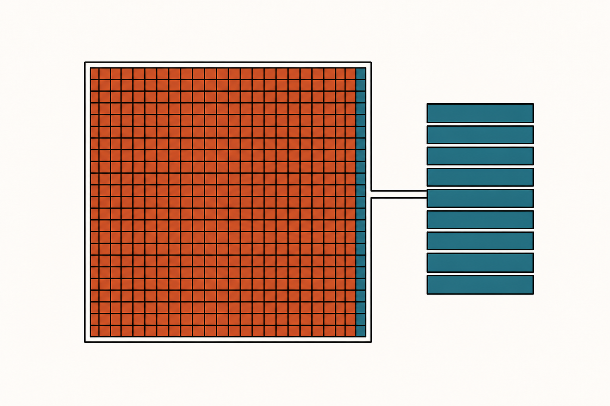

> **The throughline:** _Arithmetic is cheap. Moving bytes is expensive. Every technique in this series is a way of buying back bandwidth._
> Built from [The Engineering Behind LLM Inference: Inside the GPU](https://www.youtube.com/watch?v=cbEhkd4ZeKs), with the numbers re-derived and the figures redrawn.

## 1. The intuition

The [Memory Wall](../inference-01-memory-wall/README.md) post ended with a number and a promise. The number was 295, the operations per byte an H100 needs before its arithmetic units stop starving. The promise was that decode sits nearly 300 times below it, spending 99% of every token waiting for weights to arrive.

That post was about what the bottleneck is. **This one is about the machine that creates it**, and it comes down to three questions. Why is a GPU built so differently from the processor in your laptop? Why does moving a byte across it cost so much more than doing arithmetic on one? And once we understand that, what can the hardware actually do to fight back?

All of it starts with a single bet about the kind of work this chip would spend its life doing.

**The bet: the work is the same few arithmetic operations, repeated across billions of numbers at once.** That is the shape of a matrix multiply, and a transformer is mostly matrix multiplies. Design a chip around that one assumption and it ends up looking nothing like a CPU.

A CPU is built to rush a single thread through as fast as possible, even when that thread keeps making unpredictable turns. So most of its silicon goes not into arithmetic but into anticipation: guessing what the thread will do next and lining up data before it is asked for, so the thread almost never stops. A chip built that way runs a few tens of fast threads at once.

A GPU makes the opposite trade.

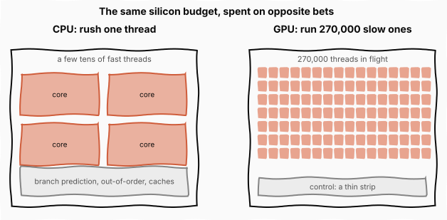

The figure is the whole design philosophy in one picture. Nvidia's H100, the data center chip we will use throughout, spends its silicon on 132 identical compute units, each holding up to 2,048 threads. Those units are called **streaming multiprocessors**, or **SMs**, and they are the repeating tile the whole chip is built from. Not one of those threads is fast on its own, and none gets the anticipation machinery a CPU lavishes on a single thread. My first reaction was that a chip full of slow threads throws performance away. For this workload it is exactly the right call: when the job is the same operation over a billion elements, a hundred thousand slow threads in parallel beat a handful of fast ones by orders of magnitude.

That structure repeats at every level, and it is worth having the hierarchy in mind before we zoom in:

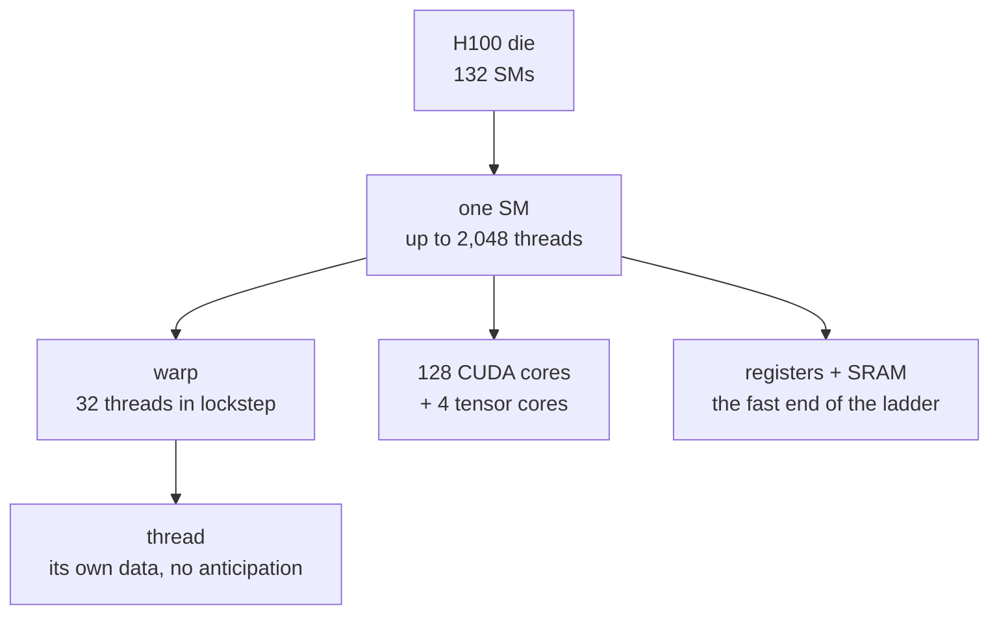

Reading it top down: the chip is one design stamped out 132 times, each copy runs thousands of threads, and those threads always move in groups of 32 called warps. Understand one SM and you understand the GPU. **Everything below the top box exists for one purpose, which is keeping the arithmetic units fed, because a math unit waiting on data is doing nothing.**

## 2. The math you need

### 2.1 One SM, stamped out 132 times

So zoom into one SM.

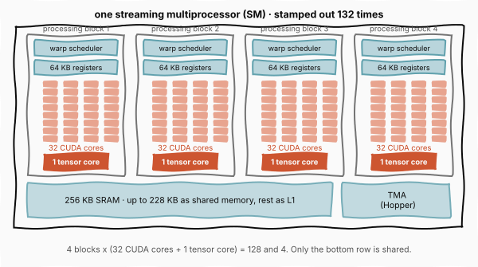

The figure shows the structure that matters, and it is a repetition rather than a collection. **An SM is four identical processing blocks**, and each block holds a warp scheduler, its own 64 KB slice of the register file, 32 CUDA cores, and exactly one tensor core. Multiply by four and you get the numbers usually quoted for an SM: 128 CUDA cores, 4 tensor cores, 4 schedulers, 256 KB of registers. Those figures all being multiples of four is not a coincidence, it is the same block counted four times.

Only two things are shared across the whole SM rather than owned by a block: the **256 KB of SRAM** (static RAM, fast memory built directly into the die rather than stacked beside it), of which up to **228 KB** can be claimed as *shared memory*, a scratchpad the program manages by hand so cooperating threads can stage data they share, while the rest serves as L1 cache. And the **Tensor Memory Accelerator**, new with Hopper, a dedicated unit whose only job is to stream blocks from main memory into that SRAM in the background so threads never spend their own instructions on the transfer.

The reason each block has its own scheduler and its own registers is latency hiding, which we get to in Section 2.4. A scheduler picks one ready warp per cycle from its own pool, and because that warp's registers never leave the block's register file, switching between warps costs nothing.

**CUDA cores and tensor cores are both arithmetic, but they are not interchangeable.** A CUDA core is a general-purpose scalar unit: it takes two numbers, multiplies them, adds a third, and produces one result per cycle. It will run any arithmetic you give it. A tensor core does exactly one thing, a matrix multiply-accumulate on whole tiles, and nothing else.

In a transformer the division of labor is sharp. The tensor cores run the large matrix multiplies: the query, key, and value projections, the attention scores, the attention output, both feed-forward matrices, and the vocabulary projection at the end. That is where the >90% of arithmetic lives. The CUDA cores run everything around them: the exponentials inside softmax, the mean and variance in layer normalization, the activation function between the two feed-forward matrices, the residual additions, the positional rotations, and all the address arithmetic that decides which bytes to fetch next.

So the tensor cores do the matrix multiply and the CUDA cores do the glue. It matters for this series that **the glue is elementwise work with almost no data reuse**, which puts it firmly on the memory-bound side of the roofline from the [Memory Wall](../inference-01-memory-wall/README.md) post. A softmax reads its inputs, does a little arithmetic, and writes them back. Section 2.6 comes back to why four tiny tensor cores still outrun the 128 general-purpose cores beside them.

Now the arithmetic that gives the chip its scale:

$$132 \text{ SMs} \times 2{,}048 \text{ threads} = 270{,}336 \text{ threads}$$

Read it plainly: the number of SMs on the die multiplied by the maximum threads each can hold gives the total the chip can keep in flight. Interpreting it: **over a quarter of a million threads are resident at once**, and that number is not a peak burst but a steady-state occupancy the hardware is designed to sustain. Hold on to it, because in Section 2.4 it turns out to be the chip's entire answer to slow memory.

### 2.2 The warp, and where the compute density comes from

Those 2,048 threads never move one at a time. They move in groups of 32 called **warps**, and a warp is the real unit the hardware schedules.

$$\frac{2{,}048 \text{ threads}}{32 \text{ threads per warp}} = 64 \text{ warps resident per SM}$$

Read it: the SM's thread capacity divided by the fixed warp width gives how many warps can sit on an SM simultaneously. Interpreting it: 64 is the number of independent instruction streams a single SM can choose between at any moment, and the four schedulers pick from that pool every cycle.

What defines a warp is that all 32 threads execute **the same instruction at the same moment, each on its own data**. The hardware fetches that instruction once, decodes it once, and fires it across all 32 lanes in lockstep. Nvidia calls this SIMT, single instruction multiple threads.

That single fact is where the GPU's compute density comes from. Fetching and decoding an instruction costs real silicon and real energy, and a scalar processor pays that cost for every operation it runs. A GPU pays it once and spreads it across 32 lanes, so the per-operation control overhead drops by a factor of 32 and nearly disappears. **The silicon a CPU spends on instruction control, a GPU spends on arithmetic**, which is exactly what the floorplan in Section 1 showed.

<strong>Check:</strong> Why does a GPU need 64 warps resident per SM when it can only issue 4 per cycle?

**Answer.** Because most resident warps are not ready on any given cycle, they are waiting on memory. The scheduler needs a deep pool of candidates so that on every cycle at least four of them have their data and can issue. Residency is not about issuing more work at once, it is about always having *some* work that is ready.

### 2.3 The memory ladder

We keep saying the math is fast and the data is slow. The reason is physical, and it is a ladder of four levels where each step away from the compute units trades speed for capacity.

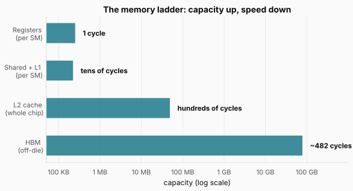

The figure puts capacity on a log axis with the access cost beside each bar, and the shape of the trade is immediate. At the top, inside each SM, are the **registers**: 256 KB, reachable in a single cycle, where a thread's working values live. Getting at them is as good as free. One step down is the **on-chip SRAM**, up to 228 KB per SM as shared memory plus L1, still on the SM and still measured in nanoseconds. Below that is the **L2 cache**, 50 MB shared across all 132 SMs and the last level that still lives on the GPU die. Then comes **HBM**, 80 GB of DRAM stacked beside the GPU but off the compute die itself, delivering 3.35 TB/s.

That last number sounds enormous, and it is the same 3.35 TB/s that set the bandwidth ceiling in the [Memory Wall](../inference-01-memory-wall/README.md) post. But bandwidth is not latency. A single HBM access still takes **hundreds of cycles** to come back, around 482 on this chip.

Top to bottom, the ladder is roughly a hundredfold drop in bandwidth and a thousandfold jump in latency. **Reaching down to HBM for a byte costs vastly more than doing arithmetic on a byte you already have up top, and that asymmetry is the whole game.** GPU programming is mostly about staging data up this ladder and keeping the tensor cores fed from the fast end.

### 2.4 Latency hiding: the answer is not to avoid the wait

A trip to HBM costs hundreds of cycles. A CPU would dodge a wait like that by guessing what comes next and prefetching. The GPU does none of that. So how does it survive a stall this long?

**It does not avoid the stall. It fills it.**

An SM keeps up to 64 warps resident, and when one warp fires off a load to HBM and stalls, a scheduler simply runs another warp that is ready. By the time the first warp's data comes back, dozens of others have taken their turn.

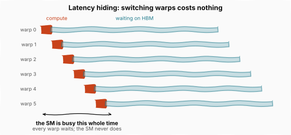

The figure shows why this works at all: the waits overlap. Each individual warp spends most of its life stalled, which looks disastrous per warp and is irrelevant per SM. What makes it possible is that **switching warps is free**. Every resident warp's registers stay in the register file the whole time, so there is nothing to save and nothing to restore. The scheduler just points at a different warp next cycle. A CPU burns real cycles to swap threads; an SM pays nothing, which is precisely what that large 256 KB register file buys.

We can put a number on how much work it takes to cover a stall. The SM's four schedulers issue up to four warp instructions per cycle, so a 482-cycle HBM latency leaves this many issue slots to fill:

$$482 \text{ cycles} \times 4 \text{ issues per cycle} \approx 1{,}930 \text{ issue slots}$$

Read it: the stall length in cycles multiplied by how many warp instructions the SM can start per cycle gives the total work needed to keep the SM busy while one warp waits. Interpreting it: those slots have to come from somewhere, and spread across 64 resident warps that is roughly **30 independent instructions per warp**. When the code has that much independent arithmetic between memory accesses, the SM never notices the latency. When it does not, the machine stalls exactly as the roofline predicted.

**That is the bridge between this post and the last one.** Arithmetic intensity is not an abstract ratio; it is a statement about whether there is enough independent work to fill 1,930 issue slots while the bytes are in transit. Decode, at one operation per byte, does not come close.

### 2.5 The two cardinal sins

Latency hiding and the warp are what make the GPU fast. Both have a failure mode, and between them they account for most of the difference between a fast kernel and a slow one.

**The first sin is warp divergence.** A warp shares one instruction stream across all 32 threads, so it can only do one thing at a time. What happens when the threads need to do different things? Say the code hits an `if`/`else` and inside one warp some threads take the `if` while the rest take the `else`. There is only one instruction stream, so the hardware cannot run both branches at once. It runs them back to back: the `if` path first with the `else` threads masked off, then the `else` path with the `if` threads masked.

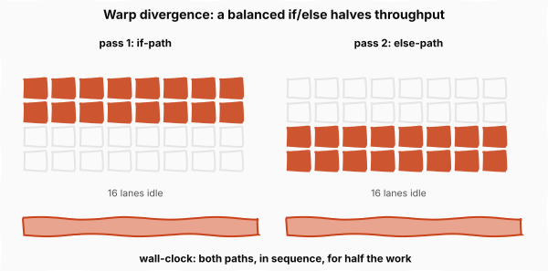

The figure shows the cost directly: each thread sits idle through the half it skipped, so a balanced `if`/`else` costs both paths in sequence and **cuts throughput in half**. Nesting branches compounds it. The arithmetic performed has not changed at all; only the control flow did.

**The second sin is about memory, and it wastes exactly the resource the whole chip is starved for.** It starts with one hardware limitation: the memory system cannot fetch a single value from HBM. It moves a whole block at a time, a cache line.

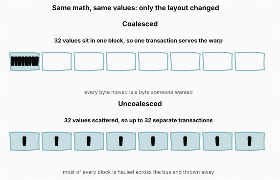

The figure contrasts the two cases. When the 32 threads in a warp want values that sit next to each other, they fall inside the same block and **one transaction serves the entire warp**. That is coalesced access, and every byte moved is a byte some thread wanted. Now scatter those 32 addresses across memory. Each thread's value lands in a different block, so the hardware runs a separate fetch for each, **up to 32 transactions where the coalesced version needed one**, and every block it drags in is mostly bytes nobody asked for, hauled across the bus and thrown away.

The arithmetic is identical either way. The only thing that changed is where the data sits in memory, and it can cost many times the bandwidth. **On a chip this memory bound, data layout is as decisive as the math.**

<strong>Check:</strong> A kernel has no branches at all and still runs at a fraction of peak. Which sin is more likely, and why?

**Answer.** Uncoalesced access. With no branches there is no divergence to pay for, but scattered addresses cost bandwidth silently: the arithmetic looks correct and the instruction count looks fine, while most of every cache line fetched is discarded. Divergence shows up in instruction counts, whereas coalescing problems only show up in achieved bandwidth.

### 2.6 The tensor core, and why four beat 128

Back in Section 2.1 we said four tensor cores per SM produce almost all of the chip's throughput, ahead of the 128 CUDA cores next to them. Here is why.

A CUDA core is **scalar**. It multiplies two numbers and adds a third, producing one result per cycle. A tensor core does not deal in single numbers at all. In one instruction it multiplies two small matrices and adds a third, producing a whole tile of results at once, where a CUDA core would grind through them one at a time. That operation is **matrix multiply-accumulate**, MMA, and it is all a tensor core does.

That narrowness is the point. A transformer spends well over 90% of its arithmetic inside matrix multiplies, so a unit that does nothing else very fast is the highest-leverage silicon Nvidia can build. The H100 carries:

$$4 \text{ tensor cores} \times 132 \text{ SMs} = 528 \text{ tensor cores}$$

Read it: tensor cores per SM multiplied by SMs on the die. Interpreting it: those 528 units produce the overwhelming majority of the chip's 989 TFLOP/s, which means **the compute ceiling from the [Memory Wall](../inference-01-memory-wall/README.md) post is really a statement about these 528 units**, not about the chip as a whole.

One caveat that matters when reading any datasheet. That peak is theoretical, assuming the cores are perfectly fed. Sustained throughput in real kernels typically reaches **50% to 80% of peak for well-tuned code**, and considerably less for unoptimized implementations. The ridge point of 295 operations per byte is computed from peak numbers, so a real kernel sits somewhat differently on the roofline than the datasheet implies.

### 2.7 Precision: the lever that pays twice

There is a second way to raise throughput, built into the hardware rather than the code: **let the tensor cores run at lower precision**. It pays off twice over. Storing a number in fewer bits lets the tensor cores push more of them through each second, and it leaves fewer bytes to haul across the memory bus. More compute and less memory traffic from the same silicon.

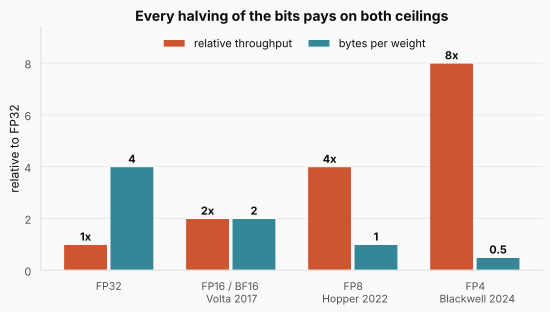

The figure shows both effects moving at once, which is the reason every tensor core generation has added a lower-precision format: Volta started with 16-bit floats in 2017, Hopper brought 8-bit in 2022, and Blackwell added 4-bit in 2024. Each halving of the bits roughly doubles throughput while halving the bytes per weight. In the language of the [Memory Wall](../inference-01-memory-wall/README.md) post, this single lever pushes on the compute ceiling and the bandwidth ceiling simultaneously, which is why it is the second of the three escape routes from that post and gets its own post later in this series.

Why can a model tolerate this? A floating-point number splits into an **exponent**, which sets its range, and a **mantissa**, which sets its fine precision. Deep learning leans on range while staying forgiving about precision. BF16 is the clean example: it keeps all eight of FP32's exponent bits, so the range is identical, and cuts the mantissa from 23 bits down to seven. Training barely notices. There is also a safeguard: the multiplies run in low precision, but results **accumulate back in FP32**, so rounding errors do not pile up across a long dot product.

One caution on the marketing. When a vendor headlines a 9x generational speedup, that number blends the precision gain with faster interconnects and ideal benchmarks. **The honest per-generation gain on real work is more like 2x to 4x.**

### 2.8 The wall, and the experiment that proves it

Latency hiding, coalescing, the whole obsession with feeding the compute units: it all traces back to one trend, and that trend is the memory wall from the previous post, now visible across GPU generations.

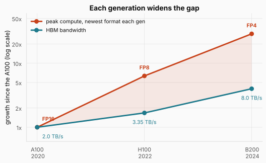

The figure tracks both ceilings across three generations. Bandwidth has grown steadily, from about 2 TB/s on the 2020 A100 to roughly 8 on the 2024 Blackwell B200, a fourfold gain in four years. That is real progress. But peak compute climbed faster still, largely because each generation added a lower-precision format that multiplies throughput, which is the mechanism we just walked through. The two curves keep diverging, and **that widening gap is the wall**.

How much does the memory side matter on its own? Nvidia effectively ran the controlled experiment for us.

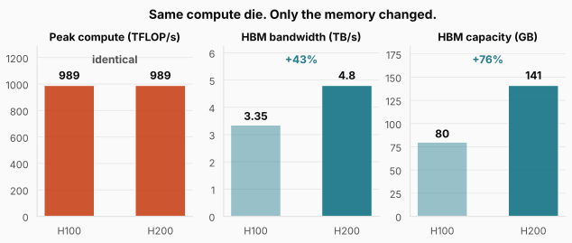

The figure is as close to a clean experiment as hardware gets. The H200 uses **the exact same compute die** as the H100: the same tensor cores, the same 989 TFLOP/s peak. The only thing that changed is the memory, 141 GB of faster HBM3e at 4.8 TB/s against the H100's 80 GB at 3.35. Every variable held constant except one.

Work the consequence for a memory-bound workload. From the previous post, decode throughput is bandwidth divided by bytes per token, so with bytes per token unchanged:

$$\frac{4.8 \text{ TB/s}}{3.35 \text{ TB/s}} = 1.43$$

Read it: the ratio of the two chips' bandwidths, with everything else in the expression identical. Interpreting it: a memory-bound workload should run about **43% faster on the H200 despite zero additional compute**. That is what the hardware delivers in practice, and it is direct evidence that inference is limited by bandwidth rather than by how fast the tensor cores can multiply. **If decode were compute bound, this chip would be exactly as fast as its predecessor.**

<strong>Check:</strong> Prefill on a long prompt is compute bound. What speedup would you expect moving it from an H100 to an H200?

**Answer.** Close to none. Prefill sits on the flat compute ceiling, and the H200 has the identical compute die, so the binding constraint has not moved. The same upgrade that buys roughly 43% on decode buys almost nothing on prefill, which is a useful reminder that "faster chip" is meaningless until you say which ceiling you were against.

### 2.9 When the model does not fit on one GPU

A frontier model's weights run to hundreds of gigabytes, well past the 80 or 141 a single chip holds. So it gets split across many GPUs that then have to talk constantly, and how fast they can talk is the next constraint.

There are two ways to wire them together. **Scale-up** packs many GPUs into one box or rack joined by NVLink, a dedicated GPU-to-GPU link, and a crossbar called NVSwitch that lets every GPU reach every other at full speed. **Scale-out** links separate boxes with ordinary data center networking, InfiniBand at a few hundred gigabits per second.

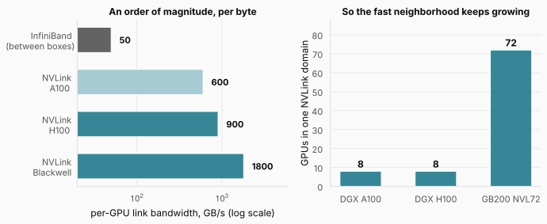

The figure shows why the distinction is not academic. NVLink runs at 600 GB/s per GPU on the A100, 900 on the H100, and 1.8 TB/s on Blackwell, roughly an order of magnitude more per byte than InfiniBand.

That gap matters because of how the model is split. **Tensor parallelism**, which the [Memory Wall](../inference-01-memory-wall/README.md) post introduced as the reason sharding raises effective bandwidth, splits each layer's matrix multiply across GPUs, so they have to exchange results at every layer, dozens of times per token. Inside an NVLink domain that exchange is cheap. Across InfiniBand it becomes the bottleneck, and the win from splitting the weights is eaten by the cost of recombining them.

So Nvidia keeps growing the fast domain. A DGX box held eight GPUs on both the A100 and the H100 generations. The Blackwell GB200 NVL72 puts **72 in a single liquid-cooled rack, all in one NVLink domain**, so far more of the model fits in the fast neighborhood before you are forced out onto the slow fabric.

### 2.10 It is not only Nvidia

It is easy to come away from all this thinking the physics is an Nvidia story. It is not. The memory wall, the value of low precision, and the preference for scaling up before scaling out apply to anyone building these chips, and there are real alternatives.

Google's **TPU** throws out the SM model entirely and builds the chip around one giant **systolic array**, a fixed grid of multiply-accumulate cells that data flows through rhythmically, with no trips back to a register file in between. That makes it well suited to dense matrix multiply and not much else, and it is rentable only on Google Cloud.

AMD's **MI300X** is closer to a GPU, and on paper it beats the H100 exactly where this post says it matters: 192 GB of HBM, more than double, so a model that needs two H100s can fit on one. And yet most teams still reach for Nvidia, and the deciding factor is not the silicon. CUDA has had almost two decades to build the libraries and tooling that all of AI now sits on, and AMD's ROCm is still catching up. **For most teams the binding constraint is software maturity, not bandwidth.**

## 3. Putting it all together

Every number in this post describes one chip, the H100, and together they explain the ceilings the previous post treated as given.

| Concept              | Number                          | Why it matters                                    |
| -------------------- | ------------------------------- | ------------------------------------------------- |
| SMs on the die       | 132                             | the chip is one design stamped out 132 times       |
| Threads in flight    | $132 \times 2{,}048 = 270{,}336$ | the raw material for hiding memory latency         |
| Warp width           | 32 threads, 64 warps per SM     | one fetch and decode amortized across 32 lanes     |
| Register file        | 256 KB per SM, 1 cycle          | why switching warps costs nothing                  |
| HBM                  | 80 GB, 3.35 TB/s, ~482 cycles   | the bandwidth ceiling, and the latency to hide     |
| Issue slots per stall | $482 \times 4 \approx 1{,}930$  | how much independent work a stall demands          |
| Tensor cores         | $4 \times 132 = 528$            | where the 989 TFLOP/s compute ceiling comes from   |
| Ridge point          | $989 / 3.35 = 295$ ops/byte     | the two ceilings above, divided                    |
| Precision ladder     | 16-bit, 8-bit, 4-bit            | each halving doubles compute and halves bytes      |
| H200 controlled test | +43% bandwidth, +0% compute     | direct evidence inference is bandwidth bound       |

Read it top to bottom and the previous post's two numbers stop being datasheet trivia. The 989 TFLOP/s is 528 tensor cores doing matrix multiply-accumulate and nothing else. The 3.35 TB/s is the bottom rung of a four-level ladder whose top rung is a thousand times faster. The ridge at 295 is those two divided, and the reason decode lands 295 times below it is that one operation per byte cannot fill 1,930 issue slots while the bytes are in transit.

**The clearest proof is the H200: hold the compute die fixed, raise only the bandwidth, and memory-bound inference gets roughly 43% faster.** A chip that is not faster at arithmetic in any way is meaningfully faster at inference.

## Where this goes next

We spent this post on the machine. We know why it is built this way, why a byte costs more than a multiply, and what the hardware does to fight back: warps to amortize control, occupancy to hide latency, tensor cores to concentrate throughput, and lower precision to push on both ceilings at once.

But hardware only sets the ceiling. Whether a given workload gets anywhere near it depends on the code that runs on it, and we have already seen how easily that code gives the advantage away. A single divergent branch halves throughput. A scattered access pattern multiplies memory traffic by up to 32. Nothing in the hardware prevents either.

The next post is about the kernels: the code that decides whether those 528 tensor cores are fed or idle, and the techniques that keep data at the fast end of the ladder once it is there.
