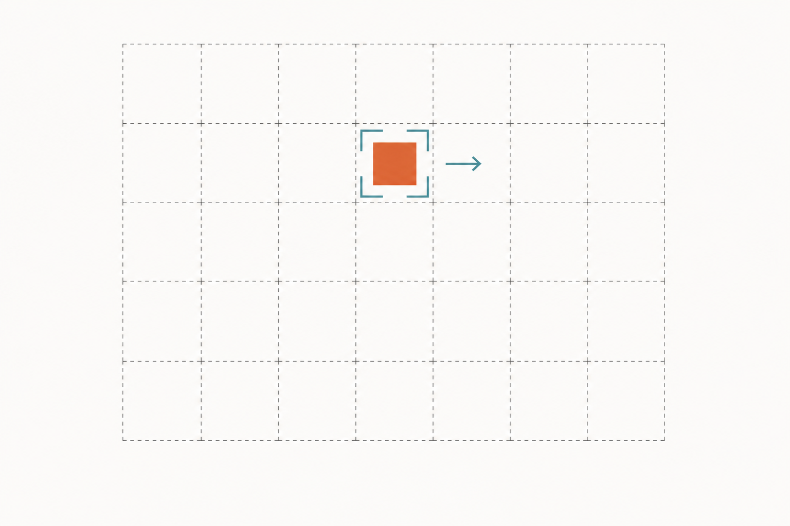
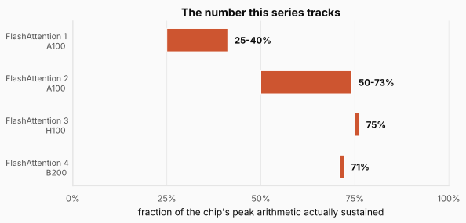
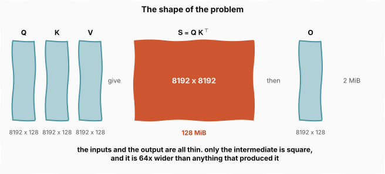
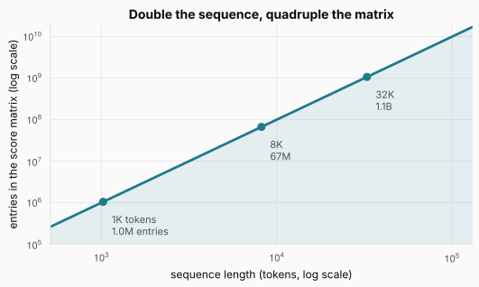
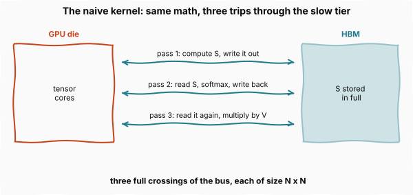
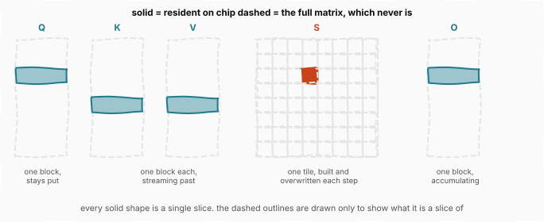
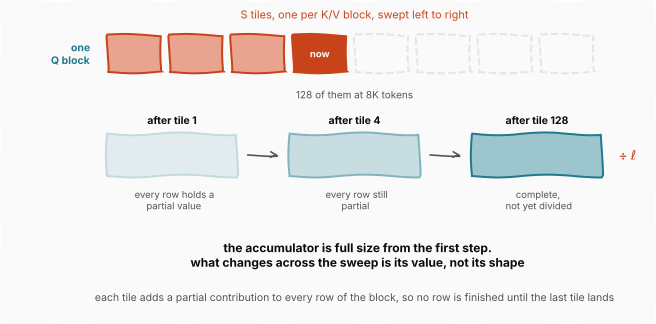
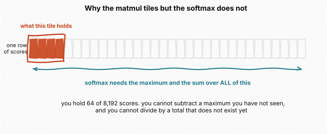
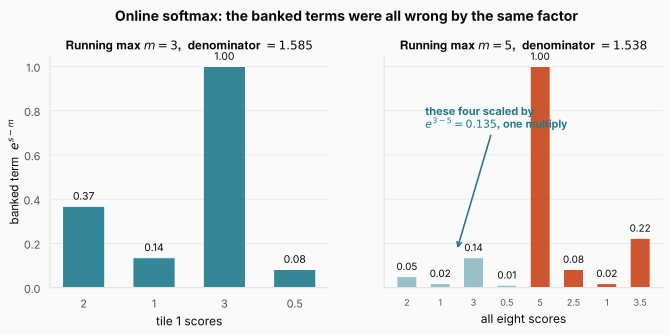
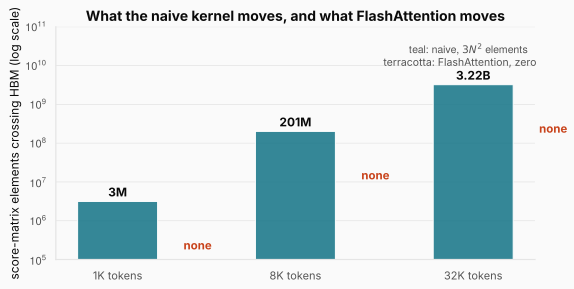

# Kernels and FlashAttention: When the Same Math Runs 7.6x Faster

> **The throughline:** _Arithmetic is cheap. Moving bytes is expensive. Every technique in this series is a way of buying back bandwidth._
> Built from [The Engineering Behind LLM Inference: Kernels and Memory](https://www.youtube.com/watch?v=30IRJQ49M2g), with the numbers re-derived, the algorithm implemented from scratch, and the figures redrawn.

## 1. The intuition

The [Inside the GPU](../inference-02-inside-the-gpu/README.md) post ended at the machine: 132 streaming multiprocessors, 528 tensor cores, and a four-level memory ladder whose bottom rung costs 482 cycles. This post is about the code that runs on it.

That code comes in units called **kernels**. A kernel is one small program. The CPU hands it to the GPU as a single piece of work, say multiplying two matrices or normalizing the rows of one, and the GPU runs that one program across thousands of threads at once. Everything the chip ever does happens this way. When PyTorch multiplies two matrices, what actually runs on the silicon is a kernel.

Here is the fact this post exists to explain. **Two kernels can compute the same attention, on the same GPU, with identical inputs and identical outputs, and one finishes up to 7.6 times faster than the other.**

The arithmetic cannot be the difference, because both perform exactly the same operations. What separates them is everything the mathematics leaves open: which threads load which bytes, from which level of memory, in what order, at what precision, and where each result is written. Every one of those is a choice about moving data, and the whole gap lives there.

We need one number to track across this and the next two posts, and it is not wall-clock time. It is the **fraction of the chip's peak arithmetic a kernel actually sustains**, which is the honest measure of whether the tensor cores are fed or idle.

The figure is the arc of the next three posts. FlashAttention 1 handles the memory wall and still leaves the tensor cores idle three quarters of the time. Versions 2 and 3 chase that idle time down to roughly a quarter. Version 4 holds the same fraction on hardware whose ceiling grew 2.25 times, which turns out to be a more interesting result than it sounds. **This post covers the first bar**, because everything after it is a refinement of the three ideas introduced here.

<strong>New here?</strong> The two numbers this post assumes, in two minutes. Skip if you have read the earlier posts.

**A model is a frozen pile of numbers.** Llama-3-70B means seventy billion of them, found during training and never changed again. At 16-bit precision each is 2 bytes, so the model is **140 GB**.

**Those numbers live somewhere different from where the math happens.** Picture a workshop: a warehouse at the back holding all your materials, a workbench at the front where the work happens, and a corridor between them. On a GPU the warehouse is HBM, the memory stacked beside the chip, and the workbench is the arithmetic units on the chip itself. To multiply anything by a weight, that weight has to travel down the corridor first.

**Both have a speed, and dividing them is the whole trick.** An H100's arithmetic units do about 989 trillion operations per second. Its corridor carries about 3.35 trillion bytes per second. Divide one by the other and the seconds cancel, leaving `295 operations per byte`. That is an exchange rate: in the time it takes to fetch one byte, the workbench could have done 295 operations instead. Do more than 295 operations per fetched byte and the arithmetic is your limit, which is the good case. Do fewer and the arithmetic units sit idle while the corridor does all the work. That break-even is called the **ridge point**, and 295 is this chip's. An A10's is about 208.

**Now price one token.** A layer is a grid of weights, and producing one token multiplies your token's vector by that grid. Every weight is touched exactly once, producing one multiply and one add, so **2 operations per weight**. At 2 bytes per weight that is **1 operation per byte**. Against a break-even of 295, decode is short by a factor of 295, and the arithmetic units run at well under 1% of capacity.

**The wall-clock consequence.** One token means dragging all 140 GB across a 3.35 TB/s corridor, which takes about **42 ms**, or roughly **24 tokens per second**. That is a ceiling, not a benchmark. No amount of clever code beats it, because the bytes genuinely have to arrive.

**And the escape.** Nothing forces you to fetch the weights for one token at a time. Process a 2,000-token prompt in one pass and each weight, still fetched once, now serves 2,000 tokens: 2,000 operations per byte, comfortably past the ridge. That is the difference between prefill and decode, and it is why they behave like completely different workloads on identical hardware.

One scoping note. There are two independent ways to attack attention's memory cost, and it is worth keeping them apart. You can **change the route the bytes take**, leaving the model bit-for-bit identical, which is what kernels do and what this series covers. Or you can **change what the model stores**, which means changing the architecture itself. That second path is multi-query attention, grouped-query attention, and DeepSeek's multi-head latent attention, and I cover all three with implementations in Chapters 4 and 5 of [My Adventures with Large Language Models](https://leanpub.com/adventures-with-llms). The two compose, and post 06 in this series is where they meet.

## 2. The math you need

### 2.1 Attention, and the object in the middle

Recall the mechanism from the [Memory Wall](../inference-01-memory-wall/README.md) post. Each token builds three vectors: a **query**, what this token is looking for; a **key**, the label it is matched against; and a **value**, the content it hands over once matched.

Key and value sound alike but never mix. **The key appears only in the score $q \cdot k$, so it decides whether a token is attended to. The value appears only in the final blend, so it decides what arrives when it is.** Think of `d[key] = value`: you search on the key and receive the value, softened so you get a weighted blend rather than one exact hit.

They are separate projections so a token can be findable on one basis and deliver something else. In "the capital of France is", the token "France" needs a key matching a question about countries and a value carrying what produces "Paris". It is also why the KV cache stores both: the key scores against future queries, the value blends in once it wins.

Stack those over a sequence of $N$ tokens and you get three matrices $Q$, $K$ and $V$, each with $N$ rows and $d$ columns, where $d$ is typically 64 to 128 per head.

The kernel's first step compares every query against every key:

$$S = \frac{QK^\top}{\sqrt{d}}$$

Read it: $Q$ is the $N \times d$ query matrix, $K^\top$ is the transpose of the key matrix so the multiplication contracts over the $d$ dimension, and $\sqrt{d}$ is a fixed scale that keeps the products from growing with head width. Interpreting it: one matrix multiply performs every pairwise comparison at once, and the result $S$ holds one score for every pair of tokens, so it is $N \times N$.

The second step turns each row of raw scores into blending weights that are positive and sum to one. That function is **softmax**, and it works in two moves: raise $e$ to each score so everything becomes positive and strong scores pull ahead, then divide by the row's total. In practice every implementation first subtracts the row's largest score, because $e^{s}$ overflows finite precision well before $s$ itself looks large:

$$\text{softmax}(s_i) = \frac{e^{s_i - m}}{\sum_j e^{s_j - m}}, \qquad m = \max_j s_j$$

Read it: $s_i$ is one score in the row, $m$ is the largest score in that row, and the denominator sums the shifted exponentials across the whole row. Interpreting it: subtracting $m$ changes nothing about the result, because the same factor $e^{-m}$ appears in the numerator and denominator and cancels. What it buys is that the largest exponent becomes exactly zero, so nothing overflows. **Hold on to the fact that this shift is free and cancels, because the entire algorithm ahead depends on it.**

The third step multiplies the weights by $V$. So attention is two matrix multiplies with a normalization between them. Everything below happens inside a single head, since heads are independent.

The trouble is the object in the middle, and the cleanest way to see it is to line up the shapes.

The figure is the whole problem in one picture. $Q$, $K$, $V$ and the output $O$ are all $N \times d$. Work the bytes at 8,192 tokens, $d = 128$, and 2 bytes per number:

$$8{,}192 \times 128 \times 2 = 2^{13} \times 2^7 \times 2^1 = 2^{21} = 2{,}097{,}152 \text{ bytes}$$

Now the middle one, which is $N \times N$ rather than $N \times d$:

$$8{,}192 \times 8{,}192 \times 2 = 2^{13} \times 2^{13} \times 2^1 = 2^{27} = 134{,}217{,}728 \text{ bytes}$$

Both are exact powers of two because the dimensions are. One mebibyte is $2^{20}$ bytes, so converting is just subtracting exponents:

$$\frac{2{,}097{,}152}{1{,}048{,}576} = \frac{2^{21}}{2^{20}} = 2^{1} = 2 \text{ MiB}$$

$$\frac{134{,}217{,}728}{1{,}048{,}576} = \frac{2^{27}}{2^{20}} = 2^{7} = 128 \text{ MiB}$$

**2 MiB against 128 MiB**, a ratio of exactly 64, which is no coincidence but simply $N/d = 8192/128$. You feed in three thin matrices, get one back, and pass through something 64 times larger than any of them.

> **Units.** $2^{27}$ bytes is 128 MiB (binary, 1024-based) or 134 MB (decimal). Both are correct. This post uses **MiB and GiB for powers of two** and reserves MB and GB for vendor specs like the H100's 80 GB of HBM.

That ratio of 64 is not fixed either, and this is the part that turns an awkward intermediate into a hard problem. The thin matrices grow in proportion to $N$, while the square one grows with $N^2$, so the gap widens with every token you add.

The figure follows that divergence. At 1,024 tokens $S$ holds about a million entries, at 8,192 tokens 67 million, and at 32,768 tokens roughly 1.1 billion. Meanwhile $Q$, $K$ and $V$ together hold $3Nd$ entries, which at 32,768 tokens and $d = 128$ is only 12.6 million. **The ratio was 64 at 8K tokens and is 85 at 32K, and it keeps climbing.**

### 2.2 What the naive kernel actually does

Attention is three operations: a matrix multiply, a softmax, then another matrix multiply. Write it in PyTorch and that is three separate lines, which become **three separate kernels**. And here is the consequence that matters, following directly from what a kernel is: each one is launched independently, so the only memory they all share is HBM. **Whatever one kernel produces for the next must be written to HBM and read back.**

The figure traces the traffic that forces. The first kernel computes $S$ and writes all of it out. The second reads it back, applies the softmax row by row, and writes the result out again. The third reads that one more time and multiplies by $V$.

It is worth asking why $S$ goes to HBM at all rather than staying on the die, because the answer is that there is nowhere else to put it. Here is the whole on-chip budget from the [Inside the GPU](../inference-02-inside-the-gpu/README.md) post, against the object we are trying to store:

| Tier | Where it sits | Capacity |
| --- | --- | --- |
| Registers | on the die, inside each SM | 256 KiB per SM, about 33 MiB across all 132 SMs |
| SRAM, shared plus L1 | on the die, inside each SM | up to 228 KiB per SM, about 29 MiB across all 132 SMs |
| L2 cache | on the die, shared by all SMs | 50 MB, and it is a cache rather than a scratchpad you can pin |
| HBM | off the die, stacked beside it | 80 GB |
| **the score matrix at 8K tokens** | needs to live somewhere | **128 MiB** |

The first three rows sit **on the GPU die**; only HBM is off it, stacked alongside on the same package, which is exactly why it is the slow tier. (The 132 is the SM count from that post.)

At 8,192 tokens $S$ already exceeds L2 and exceeds every SM's SRAM combined. The binding comparison is harsher still: a thread block runs on one SM and can use only that SM's 228 KiB, cannot borrow from neighbors, and cannot allocate in L2 because a cache decides its own contents. So the real ratio is 128 MiB against 228 KiB, about 575x, growing quadratically to 2 GiB at 32,768 tokens.

**HBM is not a choice the naive kernel makes. It is the only tier the object fits in.**

Now price it. The arithmetic is matrix multiplication, exactly what tensor cores are built for, so the math is not the problem. The traffic is: bytes grow as $N^2$ while useful work per byte stays small, dropping attention deep into the memory-bound corner of the roofline from the [Memory Wall](../inference-01-memory-wall/README.md) post.

**And notice what is doing all that commuting. $S$ is scratch.** Nobody trained it, nothing outside this operation reads it, and it dies the moment the third kernel ends. So the fix cannot be to store it somewhere better, because there is nowhere better. **It has to be to never have all of $S$ at once.**

### 2.3 Changing what you count

That is **FlashAttention**, published in 2022 by Tri Dao and collaborators, and it begins with a change of accounting rather than a new algorithm.

Since attention is memory bound, its wall-clock time is set by bytes moved rather than operations performed. So the paper changes what it counts. The cost model becomes **the reads and writes that cross between HBM and SRAM**, and the authors call this **IO-awareness**.

That reframing is what unlocks the problem. "Where do we store a 128 MiB matrix" has no answer on this hardware. "How few bytes must cross the bus" has a very good one, and it turns out the answer is zero.

### 2.4 Tiling, and why it is exact

Zero bytes crossing the bus means $S$ must never exist in full, anywhere. So stop asking for it in full: **cut it into blocks small enough to fit in SRAM, work on one block at a time, and accumulate the result as we go.** Cutting the work up this way is called **tiling**, and it is the first of FlashAttention's three ideas.

That would solve the memory problem outright, since we would only ever need room for one block. It is worth nothing, though, unless the accumulated answer is the same answer. So let us check, in symbols rather than numbers, because what matters is that it holds for any input rather than for one.

**Notation first.** Take four tokens and a head dimension of three, which keeps the matrices readable. Nothing below depends on either number. Written out element by element, $Q$ has one row per token and one column per dimension:

$$Q = \begin{bmatrix} q_{11} & q_{12} & q_{13} \\ q_{21} & q_{22} & q_{23} \\ q_{31} & q_{32} & q_{33} \\ q_{41} & q_{42} & q_{43} \end{bmatrix} = \begin{bmatrix} q_1 \\ q_2 \\ q_3 \\ q_4 \end{bmatrix}$$

Read it: $q_{ij}$ is token $i$'s value in dimension $j$, and on the right each row collapses to one symbol. Interpreting it: **$q_1$ means that entire first row**, token 1's query as three numbers. The shorthand is what the argument uses from here, since only which row an element belongs to ever matters.

$K$ and $V$ are the same shape and use the same convention, so $k_{ij}$ and $v_{ij}$ name a key and a value element the same way, and $k_1$ is token 1's whole key row:

$$K = \begin{bmatrix} k_1 \\ k_2 \\ k_3 \\ k_4 \end{bmatrix}, \qquad V = \begin{bmatrix} v_1 \\ v_2 \\ v_3 \\ v_4 \end{bmatrix}$$

Transposing $K$ turns those rows into columns, which is what lines the product up:

$$K^\top = \begin{bmatrix} k_{11} & k_{21} & k_{31} & k_{41} \\ k_{12} & k_{22} & k_{32} & k_{42} \\ k_{13} & k_{23} & k_{33} & k_{43} \end{bmatrix} = \begin{bmatrix} k_1^\top & k_2^\top & k_3^\top & k_4^\top \end{bmatrix}$$

Read it: the elements are the same numbers, with the index pair read the other way round, so $k_{21}$ sat in row 2 column 1 and now sits in row 1 column 2. Interpreting it: **the shape went from 4 by 3 to 3 by 4, and each token's key is now a column.** A 4 by 3 cannot multiply another 4 by 3, but 4 by 3 times 3 by 4 works and gives the 4 by 4 we want.

> **The transpose is notation, not work.** Nothing in the kernel ever rearranges $K$ in memory. A dot product multiplies corresponding elements and adds them, so it does not care whether either vector is called a row or a column. In the kernel $K$ is read straight out of HBM in whatever layout it was stored in, and the tensor core is told which way to walk it. Transposing an $N \times d$ matrix for real would mean a full read and write of it, which is exactly the traffic this whole post is trying to avoid.

**The scores.** Multiplying gives one entry per ordered pair:

$$S = QK^\top = \begin{bmatrix} q_1 \cdot k_1^\top & q_1 \cdot k_2^\top & q_1 \cdot k_3^\top & q_1 \cdot k_4^\top \\ q_2 \cdot k_1^\top & q_2 \cdot k_2^\top & q_2 \cdot k_3^\top & q_2 \cdot k_4^\top \\ q_3 \cdot k_1^\top & q_3 \cdot k_2^\top & q_3 \cdot k_3^\top & q_3 \cdot k_4^\top \\ q_4 \cdot k_1^\top & q_4 \cdot k_2^\top & q_4 \cdot k_3^\top & q_4 \cdot k_4^\top \end{bmatrix} = \begin{bmatrix} s_{11} & s_{12} & s_{13} & s_{14} \\ s_{21} & s_{22} & s_{23} & s_{24} \\ s_{31} & s_{32} & s_{33} & s_{34} \\ s_{41} & s_{42} & s_{43} & s_{44} \end{bmatrix}$$

Read it: the middle form writes each entry as a **dot product** of one query row with one key row, transposed into a column so the shapes line up, and a dot product means multiply corresponding elements and add the results. Written out for the top-left entry:

$$q_1 \cdot k_1^\top = q_{11}k_{11} + q_{12}k_{12} + q_{13}k_{13} = s_{11}$$

Interpreting it: three multiplications and two additions **collapse into a single number**, so the vectors disappear at this step. From here on $S$ is a grid of plain scalars, and each one was built from exactly one query row and one key row, consulting no other token.

**The weights.** Softmax runs along each row independently, changing the numbers but nothing else:

$$P = \begin{bmatrix} p_{11} & p_{12} & p_{13} & p_{14} \\ p_{21} & p_{22} & p_{23} & p_{24} \\ p_{31} & p_{32} & p_{33} & p_{34} \\ p_{41} & p_{42} & p_{43} & p_{44} \end{bmatrix}$$

Same shape as $S$, still scalars, each row now summing to 1.

**The output.** Now multiply by $V$, and this time write $V$ out in full so the products are visible:

$$O = PV = \begin{bmatrix} p_{11} & p_{12} & p_{13} & p_{14} \\ p_{21} & p_{22} & p_{23} & p_{24} \\ p_{31} & p_{32} & p_{33} & p_{34} \\ p_{41} & p_{42} & p_{43} & p_{44} \end{bmatrix} \begin{bmatrix} v_{11} & v_{12} & v_{13} \\ v_{21} & v_{22} & v_{23} \\ v_{31} & v_{32} & v_{33} \\ v_{41} & v_{42} & v_{43} \end{bmatrix}$$

$O$ comes out 4 by 3, one row per token, so it uses the same convention as everything else: $o_{ij}$ is an element, $o_1$ is the whole first row. Take that row one element at a time, each being row 1 of $P$ against one column of $V$:

$$o_{11} = p_{11}v_{11} + p_{12}v_{21} + p_{13}v_{31} + p_{14}v_{41}$$

$$o_{12} = p_{11}v_{12} + p_{12}v_{22} + p_{13}v_{32} + p_{14}v_{42}$$

$$o_{13} = p_{11}v_{13} + p_{12}v_{23} + p_{13}v_{33} + p_{14}v_{43}$$

Rows 2, 3 and 4 work identically, using rows 2, 3 and 4 of $P$. All twelve elements:

$$O = \begin{bmatrix} o_{11} & o_{12} & o_{13} \\ o_{21} & o_{22} & o_{23} \\ o_{31} & o_{32} & o_{33} \\ o_{41} & o_{42} & o_{43} \end{bmatrix} = \begin{bmatrix} o_1 \\ o_2 \\ o_3 \\ o_4 \end{bmatrix}$$

That is the complete answer. Now rewrite it in a way that changes nothing, because blocking needs a different grouping. A block is a **group of rows of $V$**, but those three lines are organized by *column*: the $o_{11}$ line collects everything landing in column 1. We need the opposite, a form saying which **row** of $V$ each piece came from, so group the terms that way:

$$
\begin{array}{crrrl}
  & p_{11}v_{11} & p_{11}v_{12} & p_{11}v_{13} & = p_{11}v_1 \\
+ & p_{12}v_{21} & p_{12}v_{22} & p_{12}v_{23} & = p_{12}v_2 \\
+ & p_{13}v_{31} & p_{13}v_{32} & p_{13}v_{33} & = p_{13}v_3 \\
+ & p_{14}v_{41} & p_{14}v_{42} & p_{14}v_{43} & = p_{14}v_4 \\
\hline
  & o_{11} & o_{12} & o_{13} & = o_1
\end{array}
$$

That is long addition, and it reads both ways. **Down the columns**, column 1 sums to the $o_{11}$ line from before, untouched, and likewise for columns 2 and 3, so nothing moved. **Across the lines**, line 1 is $p_{11}$ scaling $v_{11}, v_{12}, v_{13}$, which together are the row $v_1$, making the line $p_{11}v_1$, the name in the right-hand column. Adding the four names gives the bottom-right entry:

$$o_1 = p_{11}v_1 + p_{12}v_2 + p_{13}v_3 + p_{14}v_4$$

Every term there is a row of three, not a single number, and rows 2 to 4 work the same way with their own weights. **An entry of $S$ used one key; a row of $O$ uses every key**, and that difference is what makes the two matrices behave differently under blocking.

**Now the same two products in blocks.** There is only one cut being made: **tokens 1 and 2 in the first group, tokens 3 and 4 in the second.** Draw it on the matrices themselves rather than defining new symbols out of nowhere. In $Q$ the tokens are rows, so the cut is a horizontal line:

$$Q = \left[\begin{array}{ccc} q_{11} & q_{12} & q_{13} \\ q_{21} & q_{22} & q_{23} \\ \hline q_{31} & q_{32} & q_{33} \\ q_{41} & q_{42} & q_{43} \end{array}\right] = \left[\begin{array}{c} q_1 \\ q_2 \\ \hline q_3 \\ q_4 \end{array}\right] = \begin{bmatrix} Q_{B1} \\ Q_{B2} \end{bmatrix}$$

$K^\top$ is the same cut, but it **looks** vertical, because transposing turned its tokens into columns:

$$K^\top = \left[\begin{array}{cc|cc} k_{11} & k_{21} & k_{31} & k_{41} \\ k_{12} & k_{22} & k_{32} & k_{42} \\ k_{13} & k_{23} & k_{33} & k_{43} \end{array}\right] = \left[\begin{array}{cc|cc} k_1^\top & k_2^\top & k_3^\top & k_4^\top \end{array}\right] = \begin{bmatrix} K^\top_{B1} & K^\top_{B2} \end{bmatrix}$$

Read it: two matrices, one cut, drawn horizontally in $Q$ and vertically in $K^\top$ purely because of the transpose. Interpreting it: **a block is not a new object, it is a pair of rows of the original matrix that we agree to load together.** $Q_{B1}$ is the top half of $Q$, nothing more. $V$ is cut the same way as $Q$, and it is drawn when its own multiply comes up.

Now redo both products with those halves. The scores become four tiles, one per pairing:

$$S = \begin{bmatrix} Q_{B1}K^\top_{B1} & Q_{B1}K^\top_{B2} \\ Q_{B2}K^\top_{B1} & Q_{B2}K^\top_{B2} \end{bmatrix}$$

Expand the first one into the full $S$, leaving the rest of the grid empty, which is what the chip actually holds after one step:

$$S = \left[\begin{array}{cc|cc} q_1k_1^\top & q_1k_2^\top & \phantom{q_1k_1^\top} & \phantom{q_1k_1^\top} \\ q_2k_1^\top & q_2k_2^\top & \phantom{q_1k_1^\top} & \phantom{q_1k_1^\top} \\ \hline \phantom{q_1k_1^\top} & \phantom{q_1k_1^\top} & \phantom{q_1k_1^\top} & \phantom{q_1k_1^\top} \\ \phantom{q_1k_1^\top} & \phantom{q_1k_1^\top} & \phantom{q_1k_1^\top} & \phantom{q_1k_1^\top} \end{array}\right]$$

Read it: those four entries are the top-left corner of the unblocked $S$, exactly, and the empty quadrants are the pairings not yet done. Interpreting it: **nothing is lost at the seam because there is no seam.** Each entry needed only its own query row and key row, both inside the block, so the filled corner is final rather than provisional. The other three tiles fill in the same way, and none can disturb this one.

Softmax leaves the shape alone, so $P$ inherits that same tiling. It is the one matrix cut **both** ways, its rows by query block and its columns by key block, which is why its blocks carry two indices. Set it against $V$, the matrix it is about to multiply:

$$
\begin{aligned}
P &= \left[\begin{array}{cc|cc} p_{11} & p_{12} & p_{13} & p_{14} \\ p_{21} & p_{22} & p_{23} & p_{24} \\ \hline p_{31} & p_{32} & p_{33} & p_{34} \\ p_{41} & p_{42} & p_{43} & p_{44} \end{array}\right] = \begin{bmatrix} P_{B11} & P_{B12} \\ P_{B21} & P_{B22} \end{bmatrix} \\[8pt]
V &= \left[\begin{array}{ccc} v_{11} & v_{12} & v_{13} \\ v_{21} & v_{22} & v_{23} \\ \hline v_{31} & v_{32} & v_{33} \\ v_{41} & v_{42} & v_{43} \end{array}\right] = \left[\begin{array}{c} v_1 \\ v_2 \\ \hline v_3 \\ v_4 \end{array}\right] = \begin{bmatrix} V_{B1} \\ V_{B2} \end{bmatrix}
\end{aligned}
$$

Read it: the indices work like $s_{ij}$, row first, so $P_{B12}$ is the top-right block, rows 1 and 2 against columns 3 and 4, holding the weights **query block 1** assigns to **key block 2**. Interpreting it: **$P$'s vertical cut and $V$'s horizontal cut are the same cut**, keys 1 and 2 against keys 3 and 4. That agreement is what makes the block multiply legal, since the columns contracted over on the left must be the rows contracted over on the right.

Now the output:

$$O = \begin{bmatrix} P_{B11}V_{B1} + P_{B12}V_{B2} \\[4pt] P_{B21}V_{B1} + P_{B22}V_{B2} \end{bmatrix}$$

Expand the two terms of the first row rather than take them on faith. $P_{B11}$ is a 2 by 2 corner of weights and $V_{B1}$ is the top two value rows:

$$P_{B11}V_{B1} = \begin{bmatrix} p_{11} & p_{12} \\ p_{21} & p_{22} \end{bmatrix}\begin{bmatrix} v_{11} & v_{12} & v_{13} \\ v_{21} & v_{22} & v_{23} \end{bmatrix} = \begin{bmatrix} p_{11}v_1 + p_{12}v_2 \\ p_{21}v_1 + p_{22}v_2 \end{bmatrix}$$

$$P_{B12}V_{B2} = \begin{bmatrix} p_{13} & p_{14} \\ p_{23} & p_{24} \end{bmatrix}\begin{bmatrix} v_{31} & v_{32} & v_{33} \\ v_{41} & v_{42} & v_{43} \end{bmatrix} = \begin{bmatrix} p_{13}v_3 + p_{14}v_4 \\ p_{23}v_3 + p_{24}v_4 \end{bmatrix}$$

A 2 by 2 times a 2 by 3 gives a 2 by 3, so each entry on the right is a row of three, written in the shorthand the long addition established:

$$p_{11}v_1 + p_{12}v_2 = \begin{bmatrix} p_{11}v_{11} + p_{12}v_{21} & p_{11}v_{12} + p_{12}v_{22} & p_{11}v_{13} + p_{12}v_{23} \end{bmatrix}$$

Both results are 2 by 3, and **both describe output rows 1 and 2**. Add them:

$$\begin{bmatrix} p_{11}v_1 + p_{12}v_2 \\ p_{21}v_1 + p_{22}v_2 \end{bmatrix} + \begin{bmatrix} p_{13}v_3 + p_{14}v_4 \\ p_{23}v_3 + p_{24}v_4 \end{bmatrix} = \begin{bmatrix} p_{11}v_1 + p_{12}v_2 + p_{13}v_3 + p_{14}v_4 \\ p_{21}v_1 + p_{22}v_2 + p_{23}v_3 + p_{24}v_4 \end{bmatrix} = \begin{bmatrix} o_1 \\ o_2 \end{bmatrix}$$

Which is the unblocked answer for those rows, rebuilt. **Neither block produced a piece of a row. Each produced a partial value for entire rows.** The result is 2 by 3 rather than 2 by 1, since $o_1$ and $o_2$ are each a row of three, and the second block row does the same for $o_3$ and $o_4$, stacking to the 4 by 3 that $O$ must be.

So both matrix multiplies decompose. Now we can choose block sizes.

### 2.5 Choosing the blocks so they fit

The block size is not arbitrary. It is chosen so the working set fits in one SM's 228 KiB, and it is worth seeing the budget explicitly. At 8,192 tokens with $d = 128$ in 16-bit, the full tensors are:

| Full tensor | Size |
| --- | --- |
| $Q$, $K$, $V$, each | 2 MiB |
| $S$ | 128 MiB |

Now take blocks of 64 rows. Every quantity shrinks by the factor $8192/64 = 128$ in its row dimension, and $S$ shrinks in both. Two of the rows below are not obvious yet, the output accumulator and the pair of running numbers, and both come from the softmax fix in Section 2.7. They are budgeted here because the space has to cover the finished algorithm:

| Resident at one moment | Shape | Size |
| --- | --- | --- |
| $Q$ block | 64 x 128 | 16 KiB |
| $K$ block | 64 x 128 | 16 KiB |
| $V$ block | 64 x 128 | 16 KiB |
| $S$ tile | 64 x 64 | 8 KiB |
| output accumulator, in 32-bit | 64 x 128 | 32 KiB |
| running max and denominator | 64 each | 0.5 KiB |
| **total** | | **88.5 KiB** |

**88.5 KiB against a 228 KiB budget.** That is the whole design constraint, and it explains the block size: 64 rows was picked because the resulting working set fits with margin. Choose 128-row blocks instead and the $S$ tile alone becomes 32 KiB while the accumulator doubles to 64 KiB, which still fits; choose 512 and it does not. A chip with less shared memory, like an A10 at around 100 KiB, forces smaller blocks.

Note also what is **not** in that table: nowhere does the 128 MiB score matrix appear. It is being computed in full, but 8 KiB at a time.

That is tiling with real numbers filled in: $Q$, $K$ and $V$ cut into 64-row blocks, each sized so the whole working set sits in one SM.

The figure draws each solid slice against the dashed outline of the matrix it is cut from, because the sizes are what make this work. One block of $Q$ stays resident while blocks of $K$ and $V$ stream past it, and each arriving pair produces one tile of $S$, which is used and immediately overwritten. Nothing dashed is ever on the chip.

**The most common misreading is that tiling uses a subset of the keys. It does not.** Every query block visits every key block; it just visits them one at a time. Tiling is a loop, not a sample, and nothing is skipped.

The figure follows one query block through its sweep, and answers a question the loop raises: after a tile is done, how much of the output exists?

Not part of it. **All of it, partially**, which is the $P_{Bij}V_{Bj}$ sum from the last section seen as it happens. The accumulator is full size from the first step and every tile adds a contribution to every one of its rows, so nothing is finished until the last tile lands. That is why the snapshots deepen in colour rather than filling from one side: the shape never changes, only the values mature. After the final tile the block is complete but still unnormalized, and one division by the row's total weight turns it into the answer.

So both matrix multiplies tile exactly. **The only thing that ever coupled a row was the softmax between them**, which is the obstacle the next section is about.

### 2.6 Why tiling should not work

Softmax needs two numbers that span the whole row: the row's maximum and its sum of exponentials. Those are exactly what tiling cannot hand it, because a tile only ever sees a slice of a row.

The figure puts the two spans side by side. The boxed cells are what a tile actually holds, 64 scores out of 8,192. The arrow underneath is what softmax demands. **You cannot subtract a maximum you have not seen, and you cannot divide by a total that does not exist yet.**

Make it concrete. You are holding the tile $[2.0,\ 1.0,\ 3.0,\ 0.5]$ and you want to turn the score 2.0 into a weight. The largest score you know about is 3.0, so you would compute $e^{2.0-3.0}$. But a 5.0 is sitting in a tile you have not reached. Every number you produce now is wrong, and you will not find out until later.

As softmax is normally written, **nothing in the row can be finished until the whole row exists**. That is precisely the object we just decided never to build, and it is exactly why the naive implementation has a middle pass at all.

### 2.7 Online softmax

The fix predates FlashAttention by four years. It is called **online softmax**, published out of Nvidia in 2018 by Milakov and Gimel'shein, and one row of eight scores shows the whole idea:

$$s = \begin{bmatrix} 2 & 1 & 3 & 0.5 & 5 & 2.5 & 1 & 3.5 \end{bmatrix}$$

**The normal way, step by step.** Softmax is $e^{s_i - m}$ over the sum of all of them. First take the row maximum, $m = 5$, and subtract it from every score:

$$s - 5 = \begin{bmatrix} -3 & -4 & -2 & -4.5 & 0 & -2.5 & -4 & -1.5 \end{bmatrix}$$

Exponentiate each one. These are the numerators, and each depends only on its own score:

$$e^{s-5} = \begin{bmatrix} 0.0498 & 0.0183 & 0.1353 & 0.0111 & 1 & 0.0821 & 0.0183 & 0.2231 \end{bmatrix}$$

Add them for the denominator, and this is the one number that depends on the entire row:

$$\ell = 0.0498 + 0.0183 + 0.1353 + 0.0111 + 1 + 0.0821 + 0.0183 + 0.2231 = 1.5381$$

Divide each numerator by it and the weights come out, summing to 1 as they must:

$$P = \begin{bmatrix} 0.0324 & 0.0119 & 0.0880 & 0.0072 & 0.6502 & 0.0534 & 0.0119 & 0.1451 \end{bmatrix}$$

**Only two of those steps needed the whole row: the maximum and the denominator.** Everything else is per-element. So those two numbers are the entire problem, and the rest of this section is about carrying them as running values. **Now do it four at a time.**

Tile 1 arrives, $[2,\ 1,\ 3,\ 0.5]$. The largest score seen so far is 3, so the shift is 3 rather than 5, and the four terms are exponentiated and added exactly as before:

$$\ell = e^{-1} + e^{-2} + e^{0} + e^{-2.5} = 0.3679 + 0.1353 + 1 + 0.0821 = 1.5853$$

Tile 2 arrives, $[5,\ 2.5,\ 1,\ 3.5]$, and it carries a 5. The running maximum moves to 5, and every term already banked subtracted 3 instead. **They are all wrong by the same factor**, exactly $e^{5-3}$, so one multiply repairs all four at once:

| after | running max $m$ | running denominator $\ell$ |
| --- | --- | --- |
| tile 1 banked | 3 | 1.5853 |
| maximum moves to 5 | 5 | $1.5853 \times e^{3-5} = 0.2145$ |
| tile 2 added on the new scale | 5 | $0.2145 + 1.3235 = 1.5381$ |

**1.5381, the same number as the whole-row version**, reached without ever holding more than four scores.

The figure makes the repair visible. On the left, tile one's four terms banked against a maximum of 3. On the right, the maximum has moved to 5, so those same four are multiplied by $e^{3-5} = 0.135$ and become the small faded bars, while tile two's terms arrive already on the correct scale. **One multiplication corrects four banked terms, and it would correct four thousand just as cheaply.**

The repair works because the shared error is a *factor* rather than an offset. You banked $e^{s-3}$ and need $e^{s-5}$, and those differ by multiplication:

$$e^{s-5} = e^{s-3} \cdot e^{3-5}$$

Multiplication distributes over addition, so applying that factor to the running total is the same as applying it to every term and re-adding them, $(a+b+c) \cdot f = fa + fb + fc$. **One multiply on one accumulated number repairs every term inside it, even though the individual terms were summed away long ago.** A subtraction would have no such property, which is why softmax puts the shift inside the exponent.

That is the whole update, written once for any tile:

$$\ell_{\text{new}} = \ell \cdot e^{m_{\text{old}} - m_{\text{new}}} + \sum_{\text{tile}} e^{s - m_{\text{new}}}$$

Read it: the first term drags everything banked so far onto the new scale, and the second adds this tile's contribution, already on that scale. Interpreting it: both are now measured against the same maximum, so they can be added.

The output needs the identical treatment, since it is built from those same exponentials and drifts off scale the same way:

$$O_{\text{new}} = O \cdot e^{m_{\text{old}} - m_{\text{new}}} + P_{\text{tile}} V_{\text{tile}}$$

Two things about that equation are easy to get backwards, and both matter.

**No division happens per tile.** It would feel natural to divide by the denominator each time so the numbers look like proper weights, but $\ell$ changes at every tile, so each division would have to be undone by the next one. $O$ therefore stays **unnormalized** for the whole sweep. Only after the last tile, when $m$ is the true row maximum and $\ell$ is the true row sum, does a single $O / \ell$ turn it into the answer.

> **One anachronism, stated plainly.** FlashAttention 1 as published does rescale the output on every inner step, dividing by the running denominator each time. Carrying $O$ unnormalized and dividing once at the end is FlashAttention 2's first change. It is shown that way here because the algorithm is far easier to hold in one piece without a division buried in the loop, and post 04 comes back to price exactly what that per-step division was costing.

**Nothing returns to HBM between tiles.** The running maximum, the denominator and the output accumulator for one $Q$ block sit in SRAM for the entire sweep, which is exactly what the 32 KiB accumulator and 0.5 KiB of running numbers were reserved for in the budget. The $Q$ block is read once at the start and its finished output written once at the end. **What streams past is $K$ and $V$; the accumulators never move.**

So the answer to "how much of the row do we need at once" is two numbers. **Attention never needed the whole row. It needed a running maximum and a running denominator.**

<strong>Check:</strong> Why does the correction work as a single multiply rather than needing per-element fixes?

**Answer.** Because every banked term subtracted the same old maximum, so every term is off by the identical factor. Factoring that constant out of the sum is exact: multiplying the accumulated total by it is the same as multiplying each term individually and re-adding them. If each term had subtracted a different value, no single multiply could repair them.

### 2.8 The whole FlashAttention algorithm, end to end

Tiling and online softmax together are the entire forward pass, and the whole thing fits in one loop:

1. **Split $Q$ into blocks of rows.** Each block is independent of every other, so this is the outer loop and one block's work never consults another's.
2. **Start three accumulators for the block in hand**, one of each per row: a running maximum at minus infinity, a running denominator at zero, and an output accumulator at zeros.
3. **Sweep the $K$ and $V$ blocks past it in pairs.** For each pair:
   - form the score tile from this $Q$ block and this $K$ block
   - take the tile's row maximums and update the running maximums
   - compute the one correction factor that update implies, and rescale both the denominator and the output accumulator by it, dragging everything banked so far onto the new scale
   - add this tile's exponentials to the denominator and its weighted values to the output, both already on that scale
4. **After the last pair**, divide the output accumulator by the denominator once and write the block out.

<!--walkthrough-->

**[Step through the algorithm interactively](https://prathameshsaraf.com/blogs/inference-03-kernels-and-flashattention/walkthrough.html)**, one tile at a time, on four tokens with real numbers. Buttons or arrow keys move between steps; click into the panel first if the keys do not respond.

**Four lines carry the algorithm**: take the new maximum, compute the correction factor, rescale the denominator, rescale the output. Everything else is bookkeeping, and none of it ever needs a full row of scores in one place.

Every step in that loop was an identity rather than a shortcut, which is why **FlashAttention is not an approximation.** That distinction matters commercially: it can be switched on without any accuracy review, which is why it became a default rather than an option.

The figure shows the traffic that disappears. At 32,768 tokens the naive kernel drags 3.2 billion score-matrix elements across the bus and FlashAttention moves zero, because $S$ never leaves the chip.

One honest caveat on that comparison, because it is easy to over-claim. This counts the score matrix only. FlashAttention still reads $K$ and $V$ once per query block, so its *total* traffic is not tiny, and the end-to-end ratio depends on the block size. The measured speedup on GPT-2 is **7.6x**, not the thousandfold the chart above might suggest in isolation, and part of that 7.6 comes from fusing several kernels into one and never allocating the intermediate at all.

### 2.9 Recomputation, a training-only detour

One piece of the paper belongs to training rather than inference, and it is worth a paragraph because it completes the principle.

Training runs every computation twice: a forward pass to make a prediction, then a backward pass to work out how each weight should change. The backward sweep needs the attention matrix a second time, and FlashAttention never stored it.

Instead of storing the matrix, it kept just enough to rebuild it: the two running numbers per row that online softmax was already carrying. During the backward pass the kernel reloads $Q$, $K$ and $V$ tile by tile and recomputes each tile of the attention matrix on chip at the exact moment it is needed. The extra multiplications are cheap because they run on data already in SRAM, and the HBM traffic they avoid is the expensive kind. Attention's memory footprint drops from quadratic in the sequence length to linear.

Inference never runs the backward pass, so this does not affect us directly. But it states the principle the whole series turns on: **never spend HBM traffic on anything you can rebuild from what is already on chip.**

### 2.10 The same algorithm as a real kernel

The loop above is the algorithm. Making it fast means writing it as a real kernel, and the practical choice today is **Triton**, a Python-embedded language where you write tile-level code and the compiler handles scheduling within a block. It is what `torch.compile` generates and what vLLM, SGLang and Unsloth hand-write.

What is worth noticing is how little has to change. The inner loop is the same four lines. What a kernel language adds is that the memory movement becomes explicit rather than implied: loads and stores are written out, each instance of the kernel declares which block of query rows it owns, and the matrix multiplies map onto the tensor cores directly. The algorithm does not change at all, only the level at which the data movement is spelled out.

Triton is the right place to learn, but it is no longer where the frontier sits. FlashAttention 3 is written in CUTLASS C++ and version 4 in Nvidia's **CuTe DSL**, which the version 4 paper reports as 2.1 to 2.7 times faster than Triton on long sequences.

## 3. Putting it all together

| Concept | What it does | Result |
| --- | --- | --- |
| The problem | $S = QK^\top/\sqrt{d}$ is $N \times N$ | 1.1B entries at 32K tokens |
| Naive kernel | materializes $S$, three HBM passes | memory bound, tensor cores waiting |
| IO-awareness | count HBM-to-SRAM traffic, not FLOPs | changes what to optimize |
| Tiling | compute $S$ one tile at a time in SRAM | $S$ never reaches HBM |
| Online softmax | carry running $m$ and $\ell$ per row | makes tiling exact, not approximate |
| Recomputation | rebuild tiles in the backward pass | memory quadratic to linear |
| Measured | GPT-2 attention | 7.6x faster, 25-40% of peak |

Read it top to bottom and the shape of the argument is that nothing about attention changed. The same two matrix multiplies, the same row-wise softmax, the same weighted sum, computed to the same answer. What changed is that a matrix 64 times larger than its own inputs stopped making round trips to the slowest memory on the chip.

**The single idea worth carrying forward is that softmax only ever needed two numbers per row.** Everyone had written it as though it needed the whole row, and that assumption alone was what made the $N \times N$ intermediate look mandatory.

## Where this goes next

FlashAttention 1 fixed the memory wall and stopped at 25 to 40% of peak. The remaining gap has nothing to do with HBM, and the next post is an inventory of exactly where the chip is still waiting.

There are three places, and they are all in the [Inside the GPU](../inference-02-inside-the-gpu/README.md) post's vocabulary. Softmax bookkeeping runs on the CUDA cores while the tensor cores hold, and on an A100 every scalar operation costs about sixteen matrix operations worth of machine time. Work is handed out as thread blocks, and a batch of two with sixteen heads produces 32 blocks for a chip with 108 multiprocessors. And inside a block, the warps were splitting the wrong matrix, forcing them to exchange partial results through shared memory before anything could finish.

Three waits, three rearrangements, and the fraction roughly doubles. That is [FlashAttention 2](../inference-04-flashattention-2/README.md), and then Hopper changes the machine underneath it.
