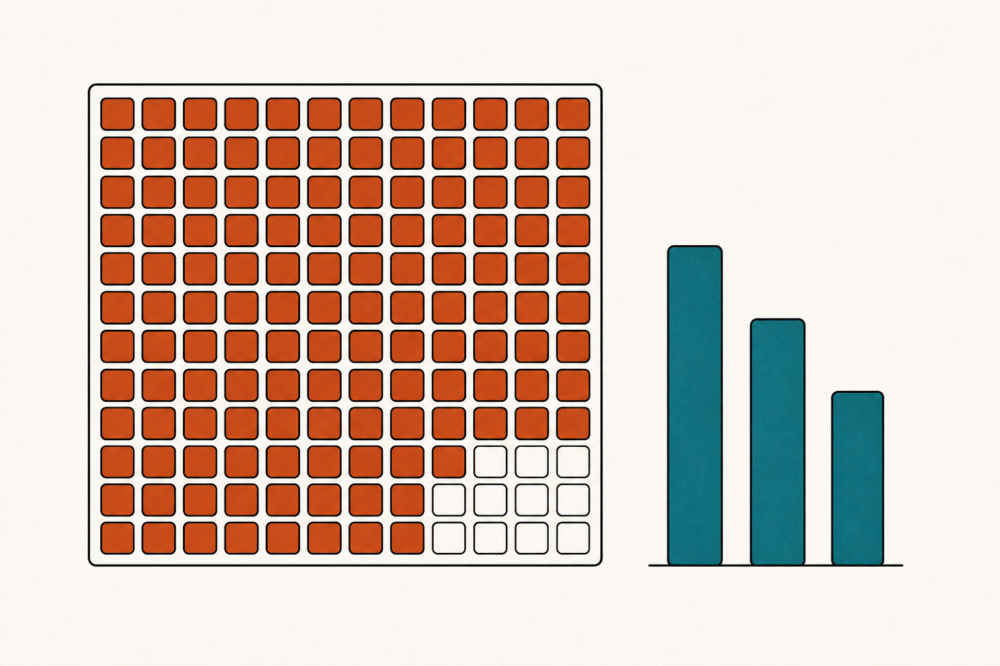
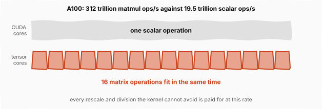
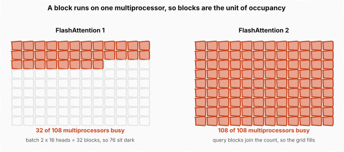
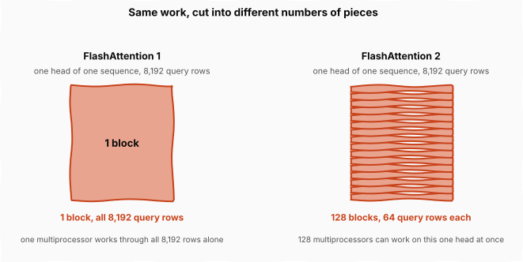
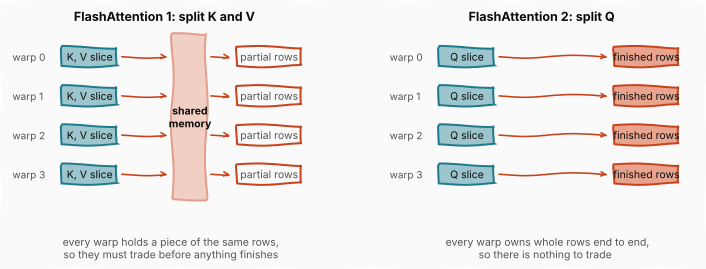
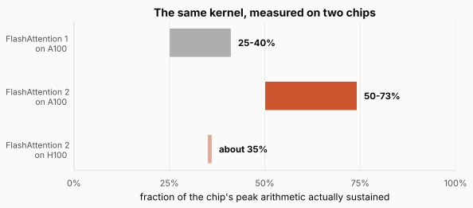

# FlashAttention 2: Three Places the Chip Was Still Waiting

> **The throughline:** _Arithmetic is cheap. Moving bytes is expensive. Every technique in this series is a way of buying back bandwidth._
> Built from [The Engineering Behind LLM Inference: Kernels and Memory](https://www.youtube.com/watch?v=30IRJQ49M2g), with the numbers re-derived and the figures redrawn.

## 1. The intuition

The [FlashAttention](../inference-03-kernels-and-flashattention/README.md) post ended on an uncomfortable number. That kernel made attention up to 7.6 times faster by keeping the score matrix off the memory bus entirely, and it still sustained only **25 to 40% of the chip's peak arithmetic**. The memory wall was handled. The tensor cores were idle anyway.

That is a strange place to end up. The whole diagnosis was that attention is memory bound, the fix moved the bytes onto the short route, and the arithmetic units still spend most of their time doing nothing.

**So the remaining waiting has nothing to do with HBM**, and the only way forward is to go looking for it. FlashAttention 2, published by Tri Dao in 2023, reads less like a new algorithm than like an inventory. Nothing about attention changes in this post. The two matrix multiplies, the softmax between them, and the online rescaling are all exactly as the last post left them. What changes is who does the work, how much of the chip gets any, and what the workers have to hand each other.

There turn out to be three places, and the answer in each case is a rearrangement.

<strong>New here?</strong> What the last two posts established, in two minutes. Skip if you have read them.

**A GPU is a warehouse and a workbench.** Model weights live in HBM, the memory stacked beside the chip, and the arithmetic happens on the chip itself. Anything you want to multiply has to travel first, and that trip is the expensive part. Arithmetic is cheap by comparison.

**Attention builds something enormous in the middle.** For a sequence of $N$ tokens, comparing every token against every other produces an $N \times N$ score matrix. At 8,192 tokens that is 128 MiB, against about 228 KiB of fast on-chip memory per processing unit, so the naive implementation writes it out to HBM and reads it back twice.

**FlashAttention 1 never builds it.** It cuts the inputs into blocks that fit on chip, computes one tile of scores at a time, and folds each tile into a running result. The obstacle was softmax, which needs the maximum and the sum of an entire row before it can normalize anything. **Online softmax** removes that by carrying two running numbers per row, a maximum and a denominator, and repairing everything banked so far with a single multiply whenever the maximum moves. The answer is exact, not approximate.

**The number this series tracks** is not wall-clock time but the **fraction of the chip's peak arithmetic a kernel actually sustains**. It is the honest measure of whether the arithmetic units are fed or idle, and FlashAttention 1 sits at 25 to 40%.

Two pieces of vocabulary from [Inside the GPU](../inference-02-inside-the-gpu/README.md) matter below. A **streaming multiprocessor**, or SM, is one of the chip's independent processing units; an A100 has 108 of them. A **warp** is a group of 32 threads that execute in lockstep, and warps are the unit the hardware actually schedules.

Everything below is measured on an **NVIDIA A100**, the chip FlashAttention 2 was written for and benchmarked on. The series usually quotes H100 numbers, and the switch matters here: the A100 has 108 SMs where the H100 has 132, and roughly a third of the arithmetic throughput. The last section is about what happens when you run this kernel on the newer chip anyway.

## 2. An inventory of the waiting

### 2.1 The exchange rate that prices everything

Before the three waits, one number explains why all three are worth fixing.

A GPU has two kinds of arithmetic hardware, and the last post leaned on the distinction: **tensor cores** do matrix multiplication and nothing else, while **CUDA cores** are general-purpose scalar units that handle everything that is not a matrix multiply. Divisions, exponentials, comparisons and rescales all run on the CUDA cores.

On an A100 those two paths are not remotely matched:

$$\frac{312 \times 10^{12} \text{ matmul ops/s}}{19.5 \times 10^{12} \text{ scalar ops/s}} = 16$$

The figure draws that ratio as time rather than throughput, because time is what the reader should feel. Both bars cover the same span of wall clock. The grey one spends it on a single scalar operation; the terracotta one fits sixteen matrix operations into it. **Every scalar operation the kernel cannot avoid costs about sixteen matrix operations worth of machine time**, and while the CUDA cores work through it, the tensor cores hold.

That is the exchange rate. It means non-matmul work is not a rounding error to be tolerated but a first-class cost, and it makes the first wait obvious once you go looking.

### 2.2 Wait one: a division inside the loop

Here is the honest version of something the last post glossed.

FlashAttention 1, as published, **rescales the output accumulator on every single inner step**. Each time a new key block arrives, it corrects the accumulated output onto the new scale *and* divides by the running denominator, so that the accumulator always holds a properly normalized result. The last post presented the algorithm with the division deferred to the very end, because it is far easier to hold in one piece that way. Deferring it is FlashAttention 2's first change.

Count how often that division happens. With a sequence of $N$ tokens and blocks of $B$ rows, there are $N/B$ query blocks, and each one sweeps all $N/B$ key blocks:

$$\text{rescales} = \frac{N}{B} \times \frac{N}{B}$$

At 8,192 tokens with 64-row blocks that is $128 \times 128 = 16{,}384$ rescales of the output accumulator, each one touching every element of a 64 by 128 block. FlashAttention 2 keeps the accumulator **unnormalized** the whole way through, carries the denominator alongside it, and divides once when the query block is finished:

$$\text{rescales} = \frac{N}{B} = 128$$

**The same work, done 128 times instead of 16,384.** The correction factor for the running maximum still applies every step, since that is what makes the answer exact, but the division does not, and division is the expensive scalar operation of the two.

Nothing about the result changes. The identity is the one the last post used to justify deferring in the first place: scaling a sum by a constant is the same as scaling every term and re-adding, so a single division at the end lands on the same number as a division per step.

<strong>Check:</strong> If the division is removed from the loop, why does the correction factor stay?

**Answer.** They fix different problems. The division normalizes, and normalizing early is pointless because the denominator is still growing, so it can safely wait. The correction factor repairs terms that were banked against a maximum that has since been beaten, and that repair cannot wait: every later term is measured against the new maximum, so the old ones must be brought onto the same scale before anything is added to them.

### 2.3 Wait two: multiprocessors with nothing to do

The second wait is entire processing units sitting idle, and seeing it takes one fact about how GPUs hand out work.

A kernel is distributed as **thread blocks**, bundles of a few hundred threads. Each block is placed on one SM and runs there to completion; it cannot be split across two, and a spare SM cannot help with someone else's block. **So the number of blocks a kernel creates is a hard ceiling on how much of the chip it can occupy.**

FlashAttention 1 creates one block per attention head per sequence in the batch. That is a natural choice, since heads are independent and sequences are independent, but it makes the block count a property of the *workload* rather than the machine:

$$\text{blocks} = \text{batch} \times \text{heads}$$

Serving two long sequences with sixteen heads gives $2 \times 16 = 32$ blocks, on a chip with 108 SMs.

The figure puts the two block counts on the same 108-cell grid, one cell per multiprocessor. On the left, 32 cells carry work and **76 sit dark, which is 70% of the chip doing nothing at all** regardless of how good the kernel running on the other 30% is. This is the case that long-context serving walks into constantly: long sequences force the batch size down, and a small batch is exactly what starves this scheme.

FlashAttention 2 adds a third source of blocks, and the cleanest way to see it is to zoom in on a single one.

Take one head of one sequence, where a sequence means one request being served, say a 8,192-token document rather than a short question. Every token contributes one query row, so this head has **8,192 rows to get through**, each row being that token's query as $d = 128$ numbers.

Under version 1 all 8,192 of those rows belong to **one block**, which sits on one multiprocessor and works through them by itself. It does not hold them all at once, since 228 KiB of SRAM is the hard limit and that is what fixed the 64-row block size in the first place. It takes 64 rows, finishes them, takes the next 64, and **loops 128 times**.

Version 2 turns those 128 loop iterations into **128 independent blocks**. Same tiles, same 64 rows at a time, same working set on chip. The 128 pieces of work that used to run one after another on a single multiprocessor now run at the same time on 128 of them.

The figure holds the work fixed and changes only how it is divided. **A block is a unit of work rather than a container with a fixed capacity**, so nothing is left half empty by making them smaller. Same rows, same arithmetic, same result, grouped into 1 piece on the left and $8192/64 = 128$ pieces on the right. **The grouping runs along tokens, never across the 128-wide dimension**, so every block still sees whole query vectors. The single piece on the left can occupy exactly one multiprocessor no matter how many are free; the 128 pieces on the right can occupy 128.

Now multiply that by the head-sequence pairs, which have not changed:

$$\text{blocks} = \text{batch} \times \text{heads} \times \frac{N}{B} = 2 \times 16 \times 128 = 4{,}096$$

**4,096 blocks for 108 multiprocessors**, where before there were 32. The chip is now oversubscribed rather than starved, which is the comfortable direction: every SM has work, and as blocks finish there are thousands more queued to replace them.

<strong>Check:</strong> Smaller blocks mean partly empty ones. How much is wasted?

**Answer.** Two kinds of waste, both small. If the token count is not a multiple of 64 the last group is partly empty, at most 63 rows, and version 1 wasted exactly the same rows because its single block also worked in 64-row tiles. The new one is that 4,096 blocks over 108 multiprocessors is 37.9 waves, so the final wave has 100 blocks for 108 slots and 8 sit idle, which is about 0.2% of the machine's time. Neither costs extra HBM traffic, since each query block had to stream all of $K$ and $V$ past itself either way.

**And the reason this is legal was established in the [FlashAttention](../inference-03-kernels-and-flashattention/README.md) post.** Its loop already began by splitting $Q$ into blocks of rows and noting that each block is independent of every other, since one query block's accumulators never consult another's. Independence was always there. Version 1 simply did not spend it on parallelism.

### 2.4 Wait three: warps trading partial results

The third wait is inside a single thread block, among its warps.

Both versions divide a block's work across four warps. The question is *which matrix* gets divided, and the two choices are not symmetric.

The figure puts the two schemes side by side, and the shared-memory column in the left panel is the whole story. FlashAttention 1 splits $K$ and $V$ across the warps. Every warp then computes a contribution to **the same output rows**, so no warp can finish anything alone; they must write their partial results into shared memory, read each other's back, and combine before the block produces anything. FlashAttention 2 splits $Q$ instead. Each warp owns a distinct set of rows from the score tile all the way to the output, and the exchange largely disappears.

**This is the same asymmetry the last post spent a section on.** An entry of the score matrix needs one query row and one key row. A row of the output needs *every* key. Split the work along the keys and you have divided something every output row depends on, so partial results are unavoidable and they have to be merged. Split along the queries and you have divided something no other row cares about, so each warp's work is complete on its own.

Stated once and for all: **partition on the index that survives to the output, not on the one that gets summed away.**

<strong>Check:</strong> Both schemes split the same block across the same four warps. Why does only one of them need shared memory?

**Answer.** Because shared memory is only needed when two warps hold pieces of the same answer. Splitting the keys gives every warp a partial value for all the rows, so the pieces must be added together somewhere both can reach. Splitting the queries gives every warp complete ownership of a few rows, and a finished row needs no one else's contribution.

### 2.5 What the three rearrangements bought

Three waits, three rearrangements, and the number this series tracks roughly doubles: from **25 to 40%** of peak on an A100 to **50 to 73%**.

The cleanest end-to-end test of an attention kernel is a full training run, since that exercises the forward pass, the backward pass and everything around them, so the headline figure is a training number rather than an inference one. On that test, GPT-style models reached **225 trillion operations per second per A100**. Against the chip's 312 trillion that is

$$\frac{225}{312} = 72\%$$

of theoretical peak sustained across an entire training run, a figure usually called **model FLOPs utilization**, or MFU. For a whole run rather than a single kernel, 72% is a genuinely high number.

Notice what did not happen. No approximation was introduced, no accuracy was traded, and attention itself was not touched. **The arithmetic was already right; it was the scheduling that was leaving the machine half empty.**

### 2.6 And what they did not buy

There is a sting in the tail, and it is the reason this series keeps going.

Every number above is an A100 number, measured on the chip the kernel was designed for. Hopper, the architecture underneath the H100, changed the machine. The kernel's assumptions did not move with it.

The figure holds the kernel fixed and changes only the chip. On the H100, FlashAttention 2 reaches about **35% of peak**, giving back most of what version 2 had won, and it does so on hardware whose peak is more than three times higher. The kernel did not get worse. The chip got features the kernel does not know exist.

Hopper shipped two of them, and FlashAttention 2 uses neither.

The first is **WGMMA**, a tensor-core instruction issued by a *warp group* of four warps acting as one. What makes it new is that it runs **asynchronously**: it starts a matrix multiply and lets the warps move on to other work while the multiply is still running.

The second is the **TMA**, the tensor memory accelerator, a dedicated copy engine introduced in the [Inside the GPU](../inference-02-inside-the-gpu/README.md) post. It moves tiles between HBM and on-chip memory entirely on its own, with no threads babysitting the transfer.

Between them, those two features let the chip **move data and do arithmetic at the same time**. FlashAttention 2 does them strictly in turn: load a tile, compute on it, load the next. So the copy engine idles during the math and the math idles during the copies, on hardware built so that neither has to wait.

## 3. Putting it all together

| The wait | Why it cost | The rearrangement | Effect |
| --- | --- | --- | --- |
| Bookkeeping between matmuls | one scalar op = 16 matmul ops on A100 | keep $O$ unnormalized, divide once per query block | 16,384 rescales become 128 |
| Idle multiprocessors | blocks = batch × heads, and a block owns one SM | also split query rows into blocks | 32 blocks become 4,096, for 108 SMs |
| Warps exchanging partials | splitting $K$/$V$ leaves every warp holding part of every row | split $Q$ instead | each warp owns whole rows, exchange disappears |
| **Measured** | | A100, attention in training | **50-73% of peak, 72% MFU** |
| **On newer hardware** | Hopper's WGMMA and TMA go unused | none of the above | **about 35% of peak on H100** |

Read the table top to bottom and the pattern is that **not one row changes what attention computes.** The score matrix is built the same way, the softmax is the same softmax, and the output is identical to the last decimal. Every gain came from asking who runs the work and what they have to pass to each other.

**The single idea worth carrying forward is that a fast kernel is not the same thing as a fast algorithm.** FlashAttention 1 had the algorithm right and still wasted three quarters of the machine. The remaining performance was sitting in scheduling decisions that looked like implementation detail, and there was roughly a factor of two hiding in them.

## Where this goes next

FlashAttention 2 doubled the fraction of peak on the chip it was written for, then lost most of that on the chip that came next, because it kept doing one thing at a time on hardware that no longer has to.

The next post is about a kernel organized around that idea from the start. If a copy engine can fetch tiles without help and a matrix multiply can run asynchronously, then the loads for the next tile and the arithmetic on the current one should overlap rather than alternate, which turns the kernel into a producer-consumer pipeline with warps assigned to different jobs rather than all doing the same one. That is FlashAttention 3, it reaches 75% of peak on the H100, and it stops being written in Triton along the way.
