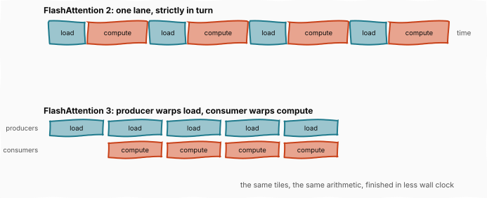
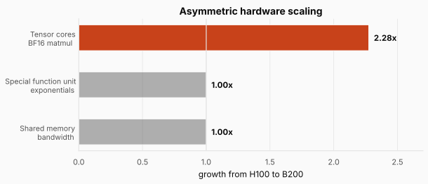
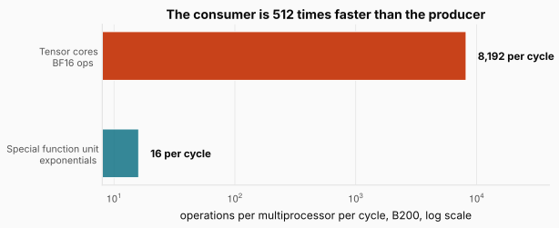
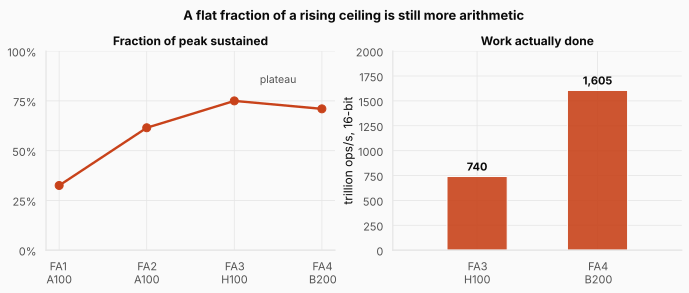

# FlashAttention 3 and 4: When the Bottleneck Moves

> **The throughline:** _Arithmetic is cheap. Moving bytes is expensive. Every technique in this series is a way of buying back bandwidth._
> Built from [The Engineering Behind LLM Inference: Kernels and Memory](https://www.youtube.com/watch?v=30IRJQ49M2g), with the numbers re-derived and the figures redrawn.

## 1. The intuition

[FlashAttention 2](../inference-04-flashattention-2/README.md) left the kernel in an awkward position. On the A100 it sustained 50 to 73% of peak. Run the identical kernel on an H100 and that fell to about 35%, not because the kernel got worse but because Hopper shipped two features it had never heard of: a copy engine that moves tiles without threads, and a matrix multiply that runs asynchronously.

Both of those features exist to let the chip **move data and do arithmetic at the same time**, and FlashAttention 2 does them strictly in turn.

That sets up the pattern this post is about. Each new generation of hardware speeds up one part of the machine far more than the rest, so the constraint does not disappear when you fix it. **It relocates.** FlashAttention 3 chases it onto Hopper, FlashAttention 4 chases it onto Blackwell, and the number we have been tracking since the start stops climbing.

The interesting part is that the number stopping is not a failure.

<strong>New here?</strong> The three posts before this one, in two minutes. Skip if you have read them.

**Attention builds an $N \times N$ score matrix in the middle**, which at 8,192 tokens is 128 MiB against roughly 228 KiB of fast memory per processing unit. The naive implementation writes it to HBM, the slow memory beside the chip, and reads it back twice.

**FlashAttention 1 never builds it.** It works in tiles that fit on chip and folds each one into a running result. Softmax normally needs a whole row before it can normalize anything, and **online softmax** removes that by carrying two running numbers per row, a maximum and a denominator, then repairing everything banked so far with a single multiply when the maximum moves. The result is exact.

**FlashAttention 2 fixed the scheduling**, not the math: it took the division out of the inner loop, split query rows across many thread blocks so the whole chip has work, and gave each warp whole output rows instead of pieces of shared ones.

**The number this series tracks** is the fraction of the chip's peak arithmetic a kernel actually sustains. It went 25-40%, then 50-73%, both on an A100.

Three pieces of hardware vocabulary from [Inside the GPU](../inference-02-inside-the-gpu/README.md) come up below. **Tensor cores** do matrix multiplies. **CUDA cores** are general-purpose scalar units. A **warp** is 32 threads executing in lockstep, and warps are what the hardware schedules.

## 2. FlashAttention 3, written for Hopper

Published in 2024, FlashAttention 3 is the first version written for the H100 rather than ported onto it. It makes two changes: one about time, one about precision.

### 2.1 Doing two things at once

The fix for load-then-compute is called **warp specialization**, and it is a division of labour.

Rather than every warp doing every job, the warps split by occupation. **Producer warps** do nothing but issue TMA loads, pulling the next tiles out of HBM. **Consumer warps** do nothing but compute, running the matrix multiplies and the softmax on tiles that have already landed. The producers run ahead while the consumers work through what has already arrived.

The figure puts the two schedules on the same clock. On top, one lane alternates: load, compute, load, compute, and the copy engine sits idle during every compute block while the arithmetic sits idle during every load. Underneath, the two run on separate lanes, each covering the other's gaps, and the same tiles finish in noticeably less wall clock. **Nothing got faster. The waiting got overlapped.**

The same idea then repeats one level down, between two different pieces of silicon. While the tensor cores run one tile's output multiply, the attention weights times $V$, the **next** tile's exponentials are computed elsewhere on the die, on a unit that is neither tensor core nor CUDA core. NVIDIA calls it the special function unit, or multi-function unit. Two tiles, two engines, one clock.

<strong>Check:</strong> Warp specialization gives some warps no arithmetic to do. Why is that not a waste?

**Answer.** Because issuing a load is not arithmetic work in the first place. A producer warp spends its time telling the copy engine what to fetch, and the copy engine does the moving. The alternative was having every warp stop computing while it waited on its own loads, which costs the same warps far more time than dedicating a few of them to fetching.

### 2.2 Dropping to eight bits without losing the answer

The second change is precision. Hopper's tensor cores can compute in **FP8**, eight bits per value, at roughly double the arithmetic rate of sixteen bits. The catch is that eight bits can express only a couple of hundred distinct values, so using them means **quantizing**: rounding every number to the nearest value the format can represent.

That goes wrong in a specific way for transformers. Their values mostly huddle near zero with a handful of outliers far out, and the format has one scale that has to stretch far enough to reach those outliers.

The figure shows what that stretching costs. The ticks are the values the format can represent, evenly spaced across whatever range the scale covers. On top, two outliers force the range wide, so the bell where almost every value actually lives sits on about three ticks out of twenty-five. **Most of the format's resolution is spent on values that never occur.**

FlashAttention 3 answers this twice.

First, **each block of values gets its own scale**, so one region's outlier no longer stretches everybody's.

Second, a trick the authors call **incoherent processing**: multiply $Q$ and $K$ by a fixed random rotation before quantizing. A rotation smears each loud coordinate thinly across all the dimensions, so no single coordinate stands out any more, which is the lower line in the figure.

And the reason this is allowed rather than merely helpful is worth stating plainly, because it sounds like it should change the answer. **A rotation never changes the dot product between two vectors.** Applied to both $Q$ and $K$, the rotations cancel inside $QK^\top$:

$$(QR)(KR)^\top = Q R R^\top K^\top = QK^\top$$

Read it: $R$ is the rotation, and $R R^\top$ is the identity because that is what being a rotation means. Interpreting it: the scores are **numerically identical**, so this buys accuracy for free rather than trading it. Together the two tricks cut the quantization error by **2.6 times**.

### 2.3 What Hopper's kernel reached

FlashAttention 3 runs 1.5 to 2 times faster than version 2. In FP16 it reaches up to **740 trillion operations per second**, which against the H100's 989 trillion is

$$\frac{740}{989} = 75\%$$

of peak. In FP8 it climbs close to 1.2 quadrillion. That 75% is the high-water mark of this whole series, and the next chip is where the climb stops.

## 3. Blackwell moves the bottleneck

### 3.1 One engine got faster and its neighbours did not

Going from the H100 to the B200, tensor core throughput in BF16 rises from roughly 1 quadrillion operations per second to 2.25 quadrillion, a factor of about 2.25.

The special function units that compute the exponential do not grow at all. Neither does the bandwidth into the multiprocessor's shared memory.

The figure is the whole problem in three bars. One engine more than doubles and the two it depends on stay exactly where they were. **When one part of a machine gets 2.25 times faster and its neighbours hold still, the bottleneck does not disappear. It moves to whichever neighbour the work needs next.**

Tri Dao's group calls this **asymmetric hardware scaling**, and it changes the job. Raising tensor core utilization is no longer the lever, because the tensor cores are no longer what the kernel is waiting on. In the forward pass the new bottleneck is the exponential unit. In the backward pass it is shared memory.

### 3.2 FlashAttention 4, written for Blackwell

Published in 2026, FlashAttention 4 answers with three changes to the algorithm and one change of tools. Each one targets a specific new bottleneck rather than the old one.

**First, the exponential itself.** Every entry of the softmax needs one, and on Blackwell the multi-function unit delivers about 16 exponentials per cycle per multiprocessor while the BF16 tensor cores beside it deliver 8,192 operations per cycle:

$$\frac{8{,}192}{16} = 512$$

The figure needs a log scale to fit both bars, which is the point. **The tensor cores can consume softmax results about 500 times faster than the unit producing them.** So FlashAttention 4 computes exponentials down two paths at once: the hardware unit keeps running, and beside it a short polynomial runs on the CUDA cores, which would otherwise sit idle in this kernel. The polynomial is a few multiplies and adds approximating the same exponential to the accuracy the kernel needs. Two producers instead of one.

**Second, the rescaling.** The correction factor from online softmax fires every time the running maximum rises, multiplying both the denominator and the output onto the new scale. FlashAttention 4 makes it **conditional**, with a threshold called $\tau$: the running maximum may drift by up to eight doublings, a factor of $2^8 = 256$, before a rescale actually happens. Smaller jumps simply ride along as bounded drift in the accumulated values, and everything is renormalized once at the end by the true final maximum and the true final denominator, so the answer is unchanged. Tri Dao puts the saving at roughly **ten times fewer rescales**.

**Third, the backward pass**, which is training work rather than inference, and where shared memory is the new wall. Blackwell adds **tensor memory**, or TMEM, about 256 KB per multiprocessor wired directly into the tensor cores. It is worth keeping the two Hopper-era acronyms apart: the TMA is a copy *engine*, something that moves data, while TMEM is a *place to keep* data. FlashAttention 4 also pairs neighbouring multiprocessors in a mode NVIDIA calls **2CTA**, where two cooperating thread blocks drive one matrix multiply together, so a single copy of the data they share serves both. The backward pass then parks its intermediates in TMEM instead of crowding shared memory. Together those roughly **halve shared memory traffic**.

**And the change of tools.** FlashAttention 4 is written entirely in **CuTe DSL**, NVIDIA's Python-embedded language for kernels, which compiles 20 to 30 times faster than the equivalent C++ templates. That sounds like a developer convenience until you consider how a kernel at this level is actually tuned: rebuild it, measure, adjust, repeat, hundreds of times over. **The speed of the compiler becomes the speed of every experiment**, which is why the tooling choice belongs in the same list as the algorithmic ones.

### 3.3 The plateau, and why it is not a disappointment

The gains are real but regime specific, and the paper is careful about this. The win is claimed for sequences of **4,000 tokens and longer**, where the BF16 forward pass runs 1.1 to 1.3 times faster than cuDNN 9.13, NVIDIA's own attention library, and 2.1 to 2.7 times faster than Triton, the open-source language much of the field writes kernels in. Below 4,000 tokens the paper does not claim a consistent lead.

Measured the same way, FlashAttention 4 reaches up to about **1,605 trillion operations per second**, which against the B200's 2,250 trillion is

$$\frac{1{,}605}{2{,}250} = 71\%$$

Set that beside FlashAttention 3's 75% on Hopper and the fraction has plateaued near three quarters, even though the ceiling underneath it grew 2.25 times.

The figure is why the plateau is worth celebrating rather than mourning. On the left, the fraction flattens. On the right, the same two kernels in absolute terms: 740 trillion operations per second becomes 1,605, which is **2.17 times more arithmetic actually performed**. Holding a constant share of a ceiling that keeps rising means the work done keeps rising with it.

And the fraction holds for the same three reasons the whole post has been about: the exponentials, the rescales, and the backward pass's bytes. Every one of those is a neighbour that did not scale.

<strong>Check:</strong> Version 4 sustains a lower fraction of peak than version 3. Why is it not a regression?

**Answer.** Because the two fractions are shares of different ceilings. 75% of the H100's BF16 peak is 740 trillion operations per second; 71% of the B200's is 1,605 trillion. The later kernel does more than twice the arithmetic while looking slightly worse on the metric, which is exactly what a fraction of a moving denominator will do.

## 4. Putting it all together

| Version | Chip | The bottleneck it attacked | How | Result |
| --- | --- | --- | --- | --- |
| 3 | H100 | loads and math alternating | producer and consumer warps, overlapping | 1.5-2x over version 2 |
| 3 | H100 | 16 bits costing double the time of 8 | per-block scales plus a random rotation | error cut 2.6x, FP8 usable |
| 4 | B200 | exponential unit, 512x slower than the consumer | second path on the idle CUDA cores | more exponentials per cycle |
| 4 | B200 | rescaling on every maximum rise | conditional on a $\tau$ threshold, drift up to 256x | about 10x fewer rescales |
| 4 | B200 | shared memory in the backward pass | 2CTA pairing plus intermediates in TMEM | shared memory traffic roughly halved |
| **Measured** | | | | **75% of peak on H100, 71% on B200** |

Read it top to bottom and one thing never appears: a change to what attention computes. Four generations, and the output is still the same two matrix multiplies with a softmax between them. **What kept changing was which part of the machine the kernel was waiting on.**

**The single idea worth carrying forward is that a bottleneck is a property of a pairing, not of a kernel.** Version 2 was excellent on the chip it was written for and mediocre one generation later, without changing a line. Hardware moved, and what had been a good decision became a bad one.

## Where this goes next

The three kernel generations in this post all optimized the same thing: the intermediates attention creates while it runs. Those were never the only things in HBM.

Every active request also keeps its keys and values there, the KV cache from [The Memory Wall](../inference-01-memory-wall/README.md). And the way serving systems laid that cache out wasted more than half of the most expensive memory in the machine, for a reason that looks entirely sensible until you count it: a system cannot know how long a response will run, so it reserved room for the longest one that might happen.

The next post is about what that cost, and about borrowing a fifty-year-old idea from operating systems to fix it.
