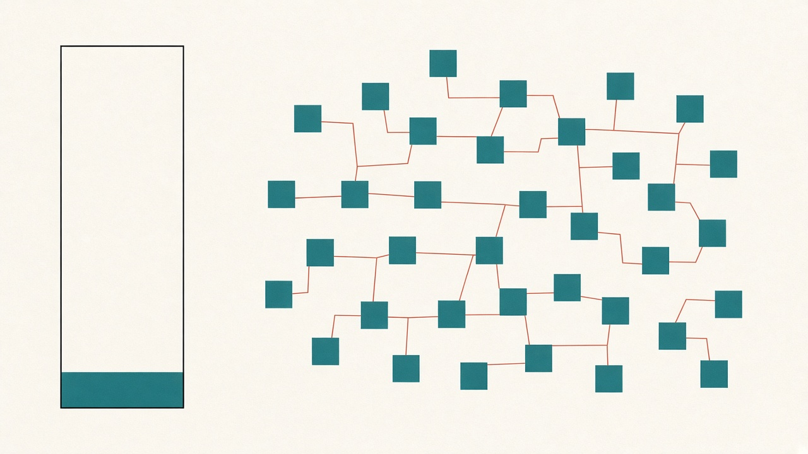
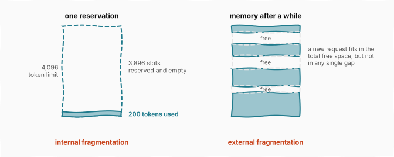
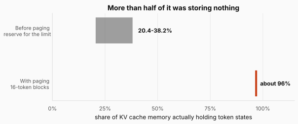
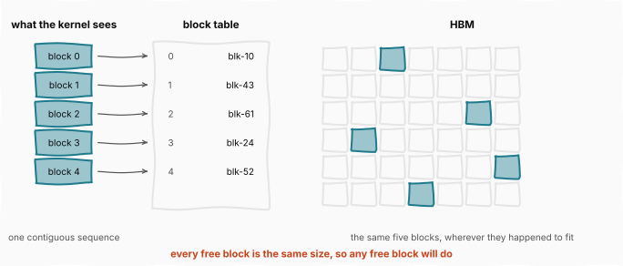
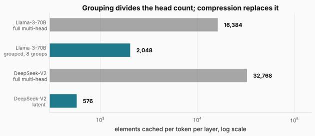

# PagedAttention: The Cache Was Storing Nothing

> **The throughline:** _Arithmetic is cheap. Moving bytes is expensive. Every technique in this series is a way of buying back bandwidth._
> Built from [The Engineering Behind LLM Inference: Kernels and Memory](https://www.youtube.com/watch?v=30IRJQ49M2g), with the numbers re-derived and the figures redrawn.

## 1. The intuition

Four posts of this series have been about the intermediates attention creates while it runs: the score matrix that never gets built, the tiles that stay on chip, the exponentials and rescales that stopped being the bottleneck. Every one of them was about **bytes that exist for the duration of one kernel**.

Those were never the only things in HBM.

Every active request also keeps its keys and values there, the KV cache from [The Memory Wall](../inference-01-memory-wall/README.md). That cache is not scratch. It lives for the whole conversation, it grows with every token generated, and on a busy server there is one per request.

Here is the number that makes this post exist. In the serving systems of 2023, measured by the vLLM team, **only 20.4% to 38.2% of KV cache memory held actual token states.** More than half of the most expensive memory in the machine was storing nothing at all.

Not fragmented across a slow path, not poorly compressed. Empty.

And the cause is a decision that looks entirely reasonable right up until you count it.

<strong>New here?</strong> What the KV cache is, in two minutes. Skip if you have read the earlier posts.

**Generating text is sequential.** The model produces one token, appends it to the input, and runs again. Each new token has to attend to every token before it.

**Recomputing the past every time would be absurd**, so the keys and values for tokens already seen are kept in HBM, the memory stacked beside the chip. That store is the **KV cache**, and producing each new token means reading all of it back.

**It is priced per token.** For every token the cache holds two vectors per attention head per layer, so its size is $2 \times \text{heads} \times \text{head dim} \times \text{layers}$ numbers. For Llama-3-70B that comes to **320 KiB per token**, which is hundreds of megabytes for one long conversation, and every byte of it is re-read on every step.

**That reading is bandwidth bound**, which is the same constraint behind every technique in this series. Arithmetic is cheap. Moving bytes is expensive.

## 2. Where the bytes live

### 2.1 Reserving for the worst case

A serving system cannot know in advance how long a response will run. The model stops when it decides to stop, which might be after five tokens or five thousand.

So systems before 2023 played it safe. For every request, they reserved **one contiguous stretch of HBM sized for the longest sequence that request might reach.**

Suppose the limit is 4,096 tokens and the response actually stops at 200.

The figure shows both ways that goes wrong. On the left, one reservation: 200 slots used, **3,896 reserved and empty**, and they stay that way until the request finishes, because nobody else is allowed to touch them. Waste inside a reservation like this is called **internal fragmentation**.

On the right is the second kind. As requests of different lengths start and finish, the free memory between reservations turns ragged. A new request can fit comfortably in the *total* free space and still find no single contiguous stretch large enough to hold it. That is **external fragmentation**.

Neither of these is a new discovery. **Operating systems textbooks have described both since the 1960s**, which is the tell that the fix might also already exist.

The figure puts the measured cost next to what paging achieves, and the gap is the entire argument for this post. The lower bar is derived rather than quoted: with 16-token blocks, a 200-token response occupies 13 blocks, which is 208 slots for 200 tokens, so $200/208 = 96.2\%$ of what it holds is real.

### 2.2 Borrowing paging from the 1960s

Operating systems solved this problem decades ago, and **PagedAttention**, published in 2023 with vLLM, carries the solution over almost unchanged.

Break the cache into **fixed-size blocks** of 16 or 32 tokens each. Give every request a **block table** that maps its logical blocks to physical block identifiers. Physically, a request's blocks can sit anywhere in HBM. Logically, the attention kernel follows the table and sees one contiguous sequence.

The figure is the whole mechanism. The kernel reads blocks 0 through 4 in order and believes it is walking a contiguous sequence. The table says those live at blk-10, blk-43, blk-61, blk-24 and blk-52, which are scattered across HBM wherever they happened to fit. **The kernel still computes exactly the same function**; it just gathers each block by following the table first. What changed is where the bytes live, plus one level of indirection to find them.

Both kinds of waste collapse. Internal fragmentation shrinks to **at most one partial block per request**, since only the final block can be half full. External fragmentation **disappears entirely**, because every free block is the same size, so any free block will do. There is no such thing as a gap that is the wrong shape.

The reclaimed memory turns directly into throughput. More concurrent requests fit in the same HBM, and vLLM serves **two to four times the throughput** of the systems before it at the same latency.

<strong>Check:</strong> Paging adds a table lookup to every block access. Why does that not cost more than it saves?

**Answer.** Because the lookup is a handful of bytes read once per block of 16 or 32 tokens, while the thing it locates is the block itself, which is thousands of bytes. The indirection rides along inside a transfer that was already happening, and it buys back memory that was sitting empty, which turns straight into more concurrent requests.

### 2.3 What the table buys that reservations could not

There is a second benefit, and it is the kind that only appears once the indirection exists.

Sometimes many sequences begin identically, sharing a system prompt or a long instruction preamble. Sometimes the server deliberately explores several candidate continuations of one prompt at once, a strategy called **beam search**.

In both cases their tables can simply **point at the same physical blocks**. A block is copied only when a sequence diverges and writes into it. On beam search the shared portions reach **up to 55% of the cache**, and the memory saved feeds straight back into batch size.

Measured end to end, vLLM's throughput runs from **1.3 times** the previous best system on plain sampling to **2.3 times** on beam search six candidates wide. The spread between those two numbers is the sharing at work: the more the requests have in common, the more the table pays.

**Sharing was impossible under contiguous reservations**, not because anyone forbade it but because two requests cannot occupy the same stretch of memory while each believes it owns a private one. The block table made a question askable that the old layout could not express.

## 3. How many bytes there need to be

Paging controls **where** the cached bytes are placed. How many of them there need to be is a separate lever, and that one is architectural: it changes the model rather than the serving system.

This is where the two paths named in [FlashAttention](../inference-03-kernels-and-flashattention/README.md) meet. Everything so far in this series has changed the route the bytes take while leaving the model bit-for-bit identical. What follows changes what the model stores.

Recall the formula. In standard multi-head attention every head carries its own keys and values, so the cache holds

$$2 \times \text{heads} \times \text{head dim} \times \text{layers}$$

numbers per token. For Llama-3-70B that is the 320 KiB per token from the first post, **and that figure already includes the optimization below.** Without it the bill is eight times larger.

### 3.1 Sharing the keys and values

In 2019 Noam Shazeer noticed where that bill lands. Producing each token means reloading all of those cached keys and values from HBM, which is bandwidth bound, and most of those bytes exist only because every head insists on a private copy.

His proposal is **multi-query attention**: keep all the query heads, but let them share a single key head and a single value head. The head count term in the formula drops to one, and the cache shrinks by the full head count. Falcon and PaLM shipped exactly this.

The price is quality. Sixty-four query heads were trained to ask sixty-four different kinds of question, and under multi-query every one of them now consults the same single description of each token. Accuracy measurably drops.

**Grouped-query attention**, from 2023, turns that all-or-nothing choice into a dial. Split the query heads into groups and give each group its own key and value head. One group is multi-query, one group per head is full multi-head, and the useful settings sit in between. Eight groups holds quality close to multi-head at close to multi-query speed, and an existing model can be converted to the layout for about **5% of its original pre-training compute**, which the paper calls up-training. That combination is why Llama 2, Llama 3 and Mistral adopted it almost immediately.

### 3.2 Compressing what a token stores

DeepSeek took a different route: rather than sharing heads, compress what each token stores at all.

**Multi-head latent attention**, from DeepSeek-V2 in May 2024, does not keep keys and values. For each token it stores one short vector called a **latent**, a compressed summary the model learns to write during training, from which keys and values can be rebuilt at the moment attention needs them. The paper calls it low-rank joint compression.

The figure puts both levers on one axis, in elements cached per token per layer so two different models can be compared. Grouping divides the head count, taking Llama-3-70B from 16,384 to 2,048, a factor of 8. Compression replaces the head count entirely: DeepSeek-V2 has 128 heads of dimension 128, so full keys and values would be 32,768 elements, and the latent stores 512, with a small 64-element companion beside it. So

$$\frac{32{,}768}{576} \approx 57$$

**The cache is 57 times smaller, and nothing is being discarded.** That is the footprint of a grouped-query model with about 2.25 groups, reached without giving up the heads.

The catch is that rebuilding keys and values costs extra matrix multiplies on every step. Which is exactly the trade this series keeps making: **arithmetic is cheap, HBM bytes are expensive**, and decode leaves the tensor cores mostly idle anyway. MLA spends idle arithmetic to buy back cache space and the bandwidth to read it.

In practice even that cost largely vanishes, for a reason worth seeing. Two matrix multiplies in a row are the same as one multiply by their product, and a query only ever meets a reconstructed key inside a chain of matrix multiplies. So the decompression matrix for keys folds into the matrix that produces queries, and the one for values folds into the matrix that produces the output. **No step ever rebuilds the full keys and values at all**; the decompression dissolves into multiplies the model was already doing.

One thing nearly breaks this. Transformers encode position by rotating each token's query and key by a position-dependent angle, a scheme called rotary position embedding, and that rotation changes from token to token, so it cannot be merged into any fixed matrix. DeepSeek's answer is to route position around the compression: a small 64-element channel rides beside the latent carrying the rotated part, while the 512-element summary stays position free so the merge stays legal. That channel is the companion counted into the 576.

Measured against DeepSeek's own previous 67-billion-parameter model, the KV cache shrinks by **93.3%** and maximum generation throughput rises to **5.76 times**. They also report quality at or above full multi-head attention, which is a claim to read carefully, since it comes from their own comparisons inside their own training recipe.

> **Where to go deeper.** This section is a survey, because all three of these are architecture rather than kernels. I cover multi-query and grouped-query attention with implementations in Chapter 4 of [My Adventures with Large Language Models](https://leanpub.com/adventures-with-llms), and multi-head latent attention, including the rotary embedding problem above, in Chapter 5.

## 4. Putting it all together

| Lever | What it changes | Mechanism | Result |
| --- | --- | --- | --- |
| The problem | nothing, this is the cost | reserve for the token limit per request | 20.4-38.2% of cache holds data |
| PagedAttention | where the bytes sit | fixed blocks plus a block table | external fragmentation gone, 2-4x throughput |
| Block sharing | how many copies exist | tables point at shared physical blocks | up to 55% shared on beam search |
| Multi-query | what the model stores | one key and value head for all queries | cache divided by the head count, quality drops |
| Grouped-query | what the model stores | one key and value head per group | 8x smaller at close to full quality |
| Latent attention | what the model stores | cache a learned summary, rebuild on the fly | 57x smaller, decompression folds away |

Read the table and the split is clean. **The first three rows leave the model untouched and rearrange the serving system. The last three change the model itself.** They compose: a grouped-query model served under paging gets both, which is what most production stacks actually run.

**The single idea worth carrying forward is that the memory was not full.** Four posts of this series went after bytes in motion, shaving traffic between HBM and the chip. This one found that the largest store in the machine was more than half empty, and the fix was not a better algorithm but a better bookkeeping scheme, borrowed from a problem that operating systems had already solved before GPUs existed.

## Where this goes next

Shrinking the cache does not change how the cache is read, and at decode the reading has a problem of its own.

The parallelism [FlashAttention 2](../inference-04-flashattention-2/README.md) relied on was splitting query rows into blocks so the whole chip has work. At decode the query is a **single new token**, one row, so the query dimension contributes exactly one block. The block count collapses to batch size times head count, and a chip with 132 multiprocessors goes hungry again for exactly the reason version 2 was supposed to have fixed.

The next post, [Flash Decoding](../inference-07-flash-decoding/README.md), is about getting decode to fill a chip: splitting the work along the sequence instead, and then removing the launch overhead that starts to dominate once each kernel has so little to do.
