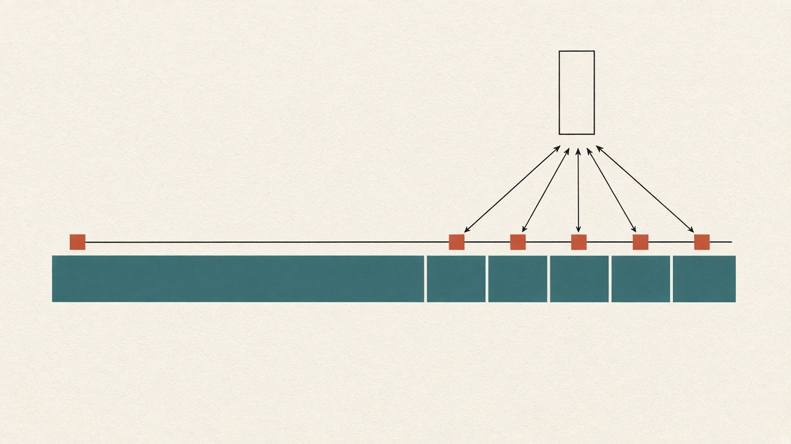
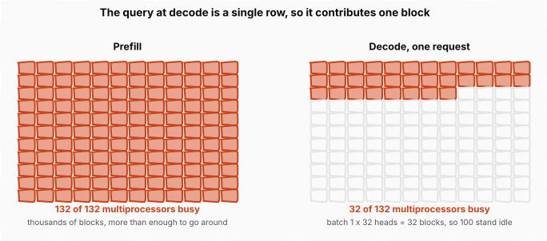
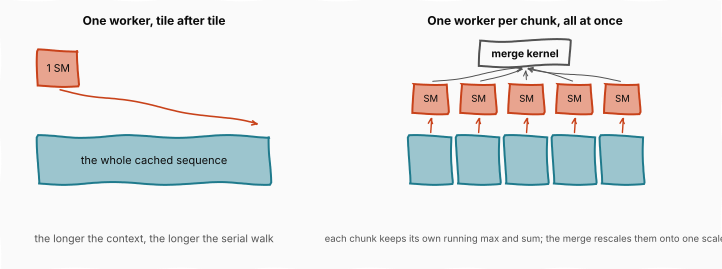
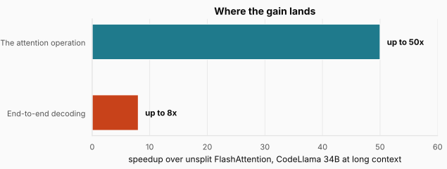
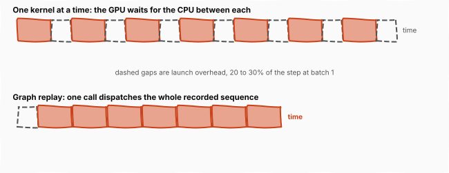

# Flash Decoding and CUDA Graphs: Filling a Chip One Token at a Time

> **The throughline:** _Arithmetic is cheap. Moving bytes is expensive. Every technique in this series is a way of buying back bandwidth._
> Built from [The Engineering Behind LLM Inference: Kernels and Memory](https://www.youtube.com/watch?v=30IRJQ49M2g), with the numbers re-derived and the figures redrawn.

## 1. The intuition

[PagedAttention](../inference-06-paged-attention/README.md) left the KV cache paged and shrunk. It did not change how the cache is **read**, and at decode the reading has a problem of its own.

Here is the awkward part. The parallelism fix in [FlashAttention 2](../inference-04-flashattention-2/README.md) worked by splitting query rows into blocks so a single sequence could fan out across the chip. That fix quietly assumed there are query rows to split.

**At decode there is one.** The model has already processed the prompt; now it produces one token, appends it, and runs again. The query is a single new token, a single row. There is nothing to cut.

So the technique that rescued prefill does nothing for the half of inference that actually dominates wall clock in a chat product, and a chip designed around having thousands of independent pieces of work receives a few dozen.

This post is about the two fixes for that, one about the chip being empty and one about the chip waiting on the CPU. It also closes out the arc, because after this the only lever left is the width of the numbers themselves.

<strong>New here?</strong> Prefill, decode, and why they differ. Skip if you have read the earlier posts.

**Generating text has two phases.** **Prefill** processes the whole prompt at once, thousands of tokens in parallel, and produces the first output token. **Decode** then produces one token at a time, each depending on the last, until the model stops.

**They behave like different workloads on identical hardware.** Prefill has enormous parallelism and is limited by arithmetic. Decode has almost none: producing one token means reading the entire model and the entire KV cache from HBM to compute a single row, so it is limited by memory bandwidth.

**The KV cache** holds the keys and values of every token seen so far, so each new token can attend to the past without recomputing it. It is read in full on every decode step.

**Work reaches the GPU as thread blocks.** Each block runs on one **streaming multiprocessor**, or SM, of which an H100 has 132, so the number of blocks a kernel creates is a ceiling on how much of the chip it can use.

**Online softmax** is the trick that makes tiled attention exact: carry a running maximum and a running sum of exponentials per row, and repair everything banked so far with one multiply when the maximum moves. It comes back in a new role below.

## 2. A chip with nothing to do

### 2.1 Counting the blocks at decode

The block count under FlashAttention 2 is one block per bundle of query rows, per head, per sequence in the batch. At decode the query dimension contributes exactly one, so the whole thing collapses to

$$\text{blocks} = \text{batch} \times \text{heads}$$

Serve a single request on a model with 32 heads and the chip receives **32 pieces of work**.

The figure counts the same chip twice. Prefill hands out thousands of blocks, comfortably more than the 132 multiprocessors can hold at once. Decode hands out 32, so **100 multiprocessors stand idle**, and each of the busy ones then walks the entire cached sequence by itself, tile after tile. The longer the context, the longer that serial walk, which is why decode gets worse exactly as conversations get more useful.

**The work is all sitting in one dimension that nobody had split: the cache itself.**

### 2.2 Splitting the cache

**Flash Decoding**, published in October 2023 by Tri Dao and collaborators, splits the cached keys and values into chunks. Every chunk gets its own block of work, which means its own multiprocessor, and each one computes the new token's attention against its own chunk **as if that chunk were the whole sequence**.

Softmax should forbid this. Its normalization couples every position in a row to every other, so partial results computed against separate chunks cannot simply be added.

What makes the split legal is the bookkeeping online softmax already keeps. Each chunk carries its own running maximum and its own running sum of exponentials, exactly as a tile did inside [FlashAttention](../inference-03-kernels-and-flashattention/README.md). Then a small second kernel merges the partial outputs at the end, rescaling each one by how far its local maximum sits below the global one, which is the same correction applied when a running maximum moves. **The merged answer is exact attention**, not an approximation.

The figure shows what changed and what did not. The cache is the same size in both panels and every byte of it is still read. On the left one worker crosses all of it in sequence; on the right five workers each cross a fifth, and a merge kernel puts the pieces on a common scale.

The neatest way to say it: **online softmax ran that bookkeeping serially down one row. Flash Decoding runs it in parallel across the chunks of the cache.** Same correction, different axis.

<strong>Check:</strong> Each chunk normalizes against its own maximum, which is wrong. Why is the merged result still exact?

**Answer.** Because being wrong by a known factor is repairable. Every value inside a chunk was divided using the same local maximum, so one multiply by the gap between that maximum and the global one corrects the whole chunk at once. That is the identity online softmax already relied on, and the merge kernel is simply applying it across chunks instead of along a row.

### 2.3 Where the gain lands

The published benchmark runs CodeLlama 34B on prompts from 512 tokens out to 64,000. Every attention implementation in the comparison slows as the context grows. This one does not, and with Flash Decoding sequence length has little impact on generation speed.

The figure separates the two numbers, because the gap between them is informative. The attention operation itself runs up to **50 times faster** than unsplit FlashAttention, while end-to-end decoding runs up to **8 times faster**. Attention was never the whole step, so fixing it completely still leaves everything else in the token's critical path, and that remainder is what the next section is about.

One honest scoping note. **The gain concentrates exactly where decode hurt most: long context and small batch.** A large batch already fills the chip through the batch dimension, by the same block-counting argument, so it has less to reclaim. If you serve short prompts at high batch size, this buys you comparatively little.

## 3. The chip waiting on the CPU

### 3.1 Hundreds of launches per token

One cost at decode is still untouched, and it has nothing to do with attention: the sheer number of separate kernels the CPU must launch to produce a single token.

Producing one token at batch size one runs a long chain of small kernels. Each layer launches a handful: one makes the queries, keys and values, one applies the position rotation, one runs attention, one combines the heads' outputs, two handle the feed-forward network's big matrix multiplies, and a few more do the small add and renormalize steps between them. Across a 32-layer model that is **hundreds of kernel launches for every generated token**.

Each launch costs the CPU a few microseconds of bookkeeping: validating arguments, queuing the work, talking to the driver. A few microseconds would normally be beneath notice.

**But at batch size one the kernels themselves often run for only a few microseconds too.** So the GPU finishes each piece of work and then idles, waiting for the CPU to hand it the next one. At small batch that dispatch overhead reaches **20 to 30% of the whole step**.

That is the kind of number that should feel offensive. A fifth to a third of the most expensive silicon in the building, spent waiting for a CPU to fill in paperwork.

### 3.2 Recording the sequence once

**CUDA graphs** amortize that overhead instead of paying it per kernel. During a warm-up step the runtime records the entire launch sequence into a graph object. From then on, a single call replays the whole graph, and hundreds of kernels are dispatched for the price of one.

The figure puts the two schedules on the same clock. The dashed boxes are launch overhead, and in the upper timeline there is one between every pair of kernels. In the lower one the recorded graph is dispatched once and the kernels run back to back. The kernels did not get faster; the gaps between them stopped being paid for individually.

The one constraint is that **a replayed graph must touch the same memory addresses every time**, which is awkward for a cache whose whole design is putting blocks wherever they fit. So serving systems lay out fixed buffers for decode specifically, to keep their graphs replayable. That is a real interaction between two of the ideas in this series rather than a footnote: paging won flexibility, graph replay wants rigidity, and production systems negotiate a truce where decode gets stable addresses.

Prefill runs a few large kernels and gains little, since a few microseconds against a kernel that runs for milliseconds is nothing. **Decode at small batch gains the most**, which is why the major serving systems all replay their decode steps this way.

## 4. Putting it all together

| Lever | What was idle | The fix | Result |
| --- | --- | --- | --- |
| Kernel intermediates | tensor cores, waiting on HBM | tiling and online softmax | score matrix never reaches HBM |
| Cache layout | memory reserved and unused | fixed blocks plus a block table | 2-4x throughput |
| Cache size | bandwidth re-reading every token | grouping, latent compression | 8x to 57x smaller |
| Parallel cache reads | 100 of 132 multiprocessors | split the cache into chunks, merge at the end | up to 8x decode at long context |
| Launch overhead | the GPU, waiting on the CPU | record once, replay the graph | reclaims 20-30% of the step |

Five levers, and the pattern across them is worth naming. **Every one made the bytes either cheaper to move or rarer to need.** Not one of them made the arithmetic better, because the arithmetic was never the problem.

**And the function never moved.** Four generations of FlashAttention, each in its headline precision, compute exact attention: the same $S = QK^\top$, the same row-wise softmax, the same multiply by $V$, identical up to the reordering of floating-point sums. Paging moved the cache without touching the math. Splitting it let one token read it in parallel. Graph replay cut the bookkeeping between kernels. None of those changed the model's output.

**Grouping and latent compression were the exception.** They shrank the cache by changing the model itself, what attention stores in the first place, and they are the one place in this series where an accuracy conversation is unavoidable.

We started with the tensor cores mostly idle, stalled waiting on memory. They now run at nearly three quarters of peak. **Every point of that climb came from changing the route the bytes take.**

## Where this goes next

One lever remains, and FlashAttention 4's BF16 headline already hinted at it: **the width of each number itself.**

It follows the same logic as everything else. Wall-clock time tracks bytes moved, so cutting each number from 16 bits to 8 halves the memory traffic outright. The compute gets cheaper too, since fewer bits per operand means more tensor core operations fit in each cycle, and the hardware keeps lowering the floor. Hopper's tensor cores run FP8. Blackwell's reach down to 4-bit FP4.

Yet FlashAttention 4's headline numbers still run in 16-bit BF16, and the reason is that **accuracy gives out before the hardware floor is reached.** Even at 8 bits, holding the error down took everything [FlashAttention 3](../inference-05-flashattention-3-and-4/README.md) brought to bear: a separate scale for every block, and outliers scattered through random rotations.

So lower precision is faster, but accuracy fails first. Navigating between those two facts is a discipline of its own, called [Quantization](../inference-08-quantization/README.md), and that is where this series goes next.
