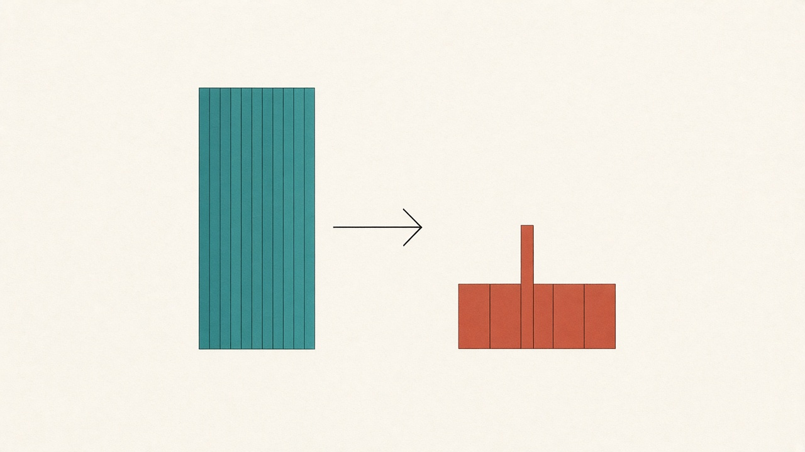
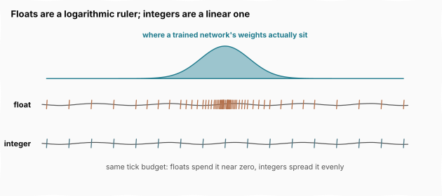
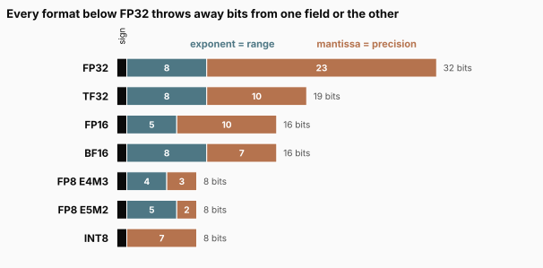
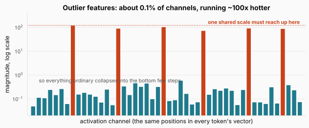
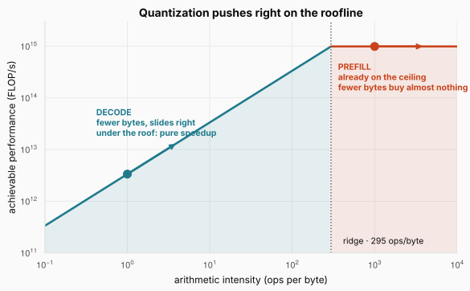
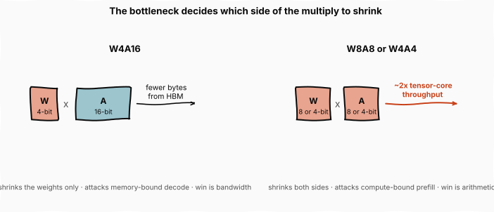

# Quantization: Spending a Tight Bit Budget Without Breaking the Model

> **The throughline:** _Arithmetic is cheap. Moving bytes is expensive. Every technique in this series is a way of buying back bandwidth._
> Built from [The Engineering Behind LLM Inference: Quantization](https://www.youtube.com/watch?v=1JWnEze9V5g), with the numbers re-derived and the figures redrawn.

## 1. The intuition

Every technique in this series so far has left one thing untouched: the numbers. Tiling changed where the score matrix lived, paging changed where the cache sat, Flash Decoding changed who read it. Through all of it the model stayed **bit-for-bit identical**, and the output never moved.

This post changes the numbers themselves.

**Quantization stores each number in fewer bits.** A weight held in 16 bits becomes a weight held in 8, or 4, and every bit shaved off the weights is gigabytes that never cross the bus. In a discipline where wall-clock time tracks bytes moved, that is the most direct lever there is.

The catch is in the word "fewer". This is the first technique in the series that is **lossy**. Fewer bits means a coarser approximation of each number, and a coarse enough approximation breaks the model. So the whole subject is one question: **how do you spend a tight bit budget without breaking anything?**

Answering it takes two posts. This one is the physics: what the bits buy, why a trained network tolerates losing most of them, what makes some networks much harder to squeeze than others, and when the squeeze pays off at all. The next one is the practice, the named methods that each handle the hard part in a different way.

<strong>New here?</strong> The four numbers this post leans on, in two minutes. Skip if you have read the series.

**A GPU is a warehouse and a workbench.** Weights live in HBM, the memory beside the chip; the arithmetic happens on the chip. Anything you multiply travels down the bus first, and that trip is the expensive part. This is [The Memory Wall](../inference-01-memory-wall/README.md).

**The roofline tells you what you are limited by.** Plot achievable performance against **arithmetic intensity**, the operations done per byte moved. The curve rises along the bandwidth limit, then flattens at the compute ceiling. They meet at the **ridge**, just under 300 operations per byte on an H100. Left of the ridge you are memory bound, with the math units idling. Right of it you are compute bound.

**Inference has two phases on opposite sides of that ridge.** **Prefill** processes the whole prompt at once, reusing each weight across hundreds of tokens, so it is compute bound. **Decode** produces one token at a time, re-reading every weight and the whole KV cache to emit a single token, so it is memory bound.

**A number is stored in three fields.** A **sign** bit, some **exponent** bits that set the range, and some **mantissa** bits that set the precision. [Inside the GPU](../inference-02-inside-the-gpu/README.md) introduced this and promised the format details would get their own post. This is that post.

## 2. What a number's bits buy

Start with scientific notation, because a binary float is the same idea in base two. Write Avogadro's number as $6.022 \times 10^{23}$ and it carries three pieces of information: a **sign**, an **exponent** that says which power of ten you sit in, and the **significand**, the $6.022$.

A float keeps the same three fields in base two: a sign bit, exponent bits, and mantissa bits holding the significand. The [Inside the GPU](../inference-02-inside-the-gpu/README.md) post established the division of labour, so one line of recall: **the exponent bits set the dynamic range, how large or small a value you can reach; the mantissa bits set the precision, how finely you can tell two nearby values apart.**

Here is the consequence that post did not draw out, and it is the key to the whole subject. Because the exponent scales the value, **floats are not evenly spaced.** They crowd together near zero and spread apart as magnitudes grow, like the ticks on a logarithmic ruler.

The figure is why this matters. The bell is where a trained network's weights actually sit, clustered tightly around zero. The float ticks put their fine resolution exactly there, dense near zero and sparse in the tails, so **a float is a natural fit for the thing it has to store.** An integer, on the other hand, spends its ticks evenly, wasting resolution out where almost no weight ever lands.

The **activations**, the values that flow through the network as it runs, do not crowd near zero the same way. That mismatch, floats fitting weights but not activations, is most of what makes quantization hard, and Section 4 is about the extreme case of it.

## 3. The ladder of formats

FP32 is the baseline: one sign bit, eight exponent, twenty-three mantissa. That buys a range near $10^{\pm 38}$ and about seven decimal digits of precision. It is also four bytes per number, too expensive to move at scale.

Every format below FP32 answers a single question: **which of those 32 bits can we afford to throw away?** Stack the answers by size and you get a ladder.

The figure draws each format to scale, so the shrinking total width is the byte saving and the internal split is the tradeoff. Read it top to bottom:

**TF32** keeps all eight exponent bits and trims the mantissa to ten. It never reaches memory: inputs stay FP32, round to TF32 for the multiply, then accumulate back in FP32. On the A100 that bought roughly eight times the single-precision throughput, since $156 \div 19.5 = 8$ in TFLOP/s.

**FP16 and BF16** both spend sixteen bits, divided in opposite ways. FP16 spends ten on the mantissa and five on the exponent, so it separates nearby values finely but reaches only a narrow window, roughly $6 \times 10^{-5}$ up to about $65{,}504$. BF16 keeps FP32's full eight exponent bits and spends just seven on the mantissa, trading precision for range. Which one wins depends on what you are doing, and the [Inside the GPU](../inference-02-inside-the-gpu/README.md) post already worked that out: training leans on range, so BF16 became the default there. At inference there are no gradients to underflow, so FP16's sharper mantissa is a common serving choice.

**FP8** splits into two variants the hardware can mix inside one matrix multiply. E4M3 spends four exponent bits and three mantissa, less range and more precision, for the forward pass. E5M2 flips it to five and two for the wider range that gradients span.

**The integers are the odd ones out.** INT8 and INT4 carry no per-value exponent at all, just evenly spaced steps under one shared scale sized to the largest value in the group. That is simple and fast in silicon, and it is exactly the linear ruler from the last figure, which is why a single wide-ranging value breaks it: one outlier stretches the shared scale, and everything ordinary collapses into the bottom few steps.

## 4. Why a trained network survives this

The ladder hands us plenty of small formats. The real question is why a network trained in full precision survives being squeezed into them at all. The answer is in the weights.

**A trained network is overparameterized.** No single weight carries much information, and rounding nudges each one up or down independently. Inside the network's long weighted sums, those nudges mostly cancel: some round up, some round down, and the errors wash out. Had they all pushed the same way they would pile up and break the model, but they do not, because they are independent.

The weights also cluster tightly around zero, and a tight cluster is easy to cover. Even INT4, with just $2^4 = 16$ distinct values to spend, lands nearly all of them where the weights actually live.

Now take those same sixteen values to the activations, and the trouble from Section 2 becomes concrete.

Most activation channels cluster near a small value, but a few run about a hundred times larger. These extremes are called **outlier features**, and Dettmers and colleagues mapped them in the LLM.int8() paper. As a transformer grows, a few channels, the same positions in every token's activation vector, start carrying values far larger than the rest. They appear abruptly in what the paper calls a **phase shift** at about 6.7 billion parameters, and from there they show up in every layer.

The counts are worth quoting exactly, because they are the reason a tenth of a percent of the network holds it hostage. The paper reports as many as **150,000 outlier values in a single sequence**, and finds the systematic ones concentrated in about **six channels**, roughly a tenth of a percent of the feature dimensions. Yet zero those six channels out and the model falls apart: the top token's share of attention drops by more than 20%, and perplexity, the standard measure of how well a model predicts text, worsens by 600 to 1000%.

The damage they do to quantization is mechanical, and it is the same mechanic the [FlashAttention 3 and 4](../inference-05-flashattention-3-and-4/README.md) post hit with FP8. One scale must cover the largest value in its group, so a channel running a hundred times hotter stretches the scale wide, and every normal value collapses into the bottom few steps where real information turns to noise. **From here, every method and every format in the next post is a different way of handling these outliers.**

<strong>Check:</strong> If the outlier channels are only about 0.1% of features, why not simply drop them and quantize the rest cleanly?

**Answer.** Because they carry information far out of proportion to their count. Zeroing the six channels drops the top token's attention share by more than 20% and worsens perplexity by hundreds of percent, so they are the opposite of noise. The whole challenge is that they must be kept, at their true magnitude, without letting them stretch the scale for everything else, which is exactly what the next post's methods do.

## 5. When quantization actually pays

Which method helps depends on what the hardware is waiting on, and the [Memory Wall](../inference-01-memory-wall/README.md) post already drew the diagram for that: the roofline.

Quantization pushes in exactly one direction on it. Fewer bytes per operation means higher arithmetic intensity, so the workload slides right.

The figure shows why the same lever helps one phase and barely touches the other. **While a workload stays left of the ridge, sliding right is pure speedup:** it is memory bound, and fewer bytes per operation means the math units wait less. Cross the ridge and the roof is flat, so fewer bytes buy almost nothing, because arithmetic was the limit, not bandwidth.

The two phases of inference land on opposite sides of that ridge. Prefill reuses every weight across hundreds of tokens, so intensity is high, it runs compute bound, and tensor core utilization on an H100 can push past 90%. Decode re-reads all the weights and the whole cache to emit one token, so it is memory bound, and utilization on the same GPU can crater to 20 to 40%.

<strong>Check:</strong> W4A16 gives a large decode speedup but almost none on prefill. Why does the same format help one phase and not the other?

**Answer.** W4A16 shrinks only the weights, so it only saves bytes, not math. Decode is memory bound, so moving fewer bytes is a direct win. Prefill is already compute bound, sitting on the flat part of the roofline, so moving fewer bytes changes nothing while the arithmetic still runs in 16 bits. To speed up prefill you have to shrink both operands and run the multiply itself in low precision, which is W8A8 or W4A4.

**Two bottlenecks call for two strategies**, and the notation is worth learning because the next post uses it throughout.

**Weight-only quantization**, written W4A16 for 4-bit weights with 16-bit activations, shrinks only the weights. That is aimed squarely at memory-bound decode: each token pulls fewer bytes from HBM, even though the math still runs in 16 bits. **The win is bandwidth, not arithmetic.**

**Weight-and-activation quantization**, W8A8 or W4A4, puts both sides of the multiply in low precision, which unlocks the tensor cores' low-precision math where halving the bits roughly doubles throughput. **That is what speeds up compute-bound prefill.** So the choice follows the phase: shrink the weights for decode, shrink both for prefill.

> **Where to go deeper.** This post and the next are about quantizing a model *after* it is trained, for serving. The companion problem, training a model in low precision from the start, is its own discipline: Chapter 5 of [My Adventures with Large Language Models](https://leanpub.com/adventures-with-llms) walks through DeepSeek-V3's FP8 training framework, including the mixed-precision forward and backward passes and a working FP8 implementation.

## 6. Putting it all together

| Idea | What it says | Consequence |
| --- | --- | --- |
| Bit fields | exponent sets range, mantissa sets precision | every small format is a different bet on which to keep |
| Float spacing | floats crowd resolution near zero | a natural fit for weights, a poor one for activations |
| Overparameterization | no weight matters much, errors cancel in the sum | networks survive rounding at all |
| Outlier features | ~6 channels run ~100x hotter past 6.7B params | one shared scale gets stretched, ordinary values turn to noise |
| Roofline slide | fewer bytes per op raises intensity | pure speedup left of the ridge, nothing to the right |
| W4A16 vs W8A8 | shrink weights, or shrink both | decode wants bandwidth, prefill wants arithmetic |

Read the table top to bottom and the shape of the subject appears. **Quantization is not one technique but a negotiation**, between the bits you can afford to move and the accuracy you cannot afford to lose, conducted almost entirely in the language of outliers.

**The single idea worth carrying forward is that the fit between a format and a network is what everything turns on.** Floats fit weights, which is why weight-only 4-bit is the safe default. Nothing fits the activation outliers cleanly, which is why the activation side is where all the cleverness lives, and where the next post spends its time.

## Where this goes next

Everything here was about *why* and *when*. The next post is *how*: the named methods, each of which handles the outliers in its own way.

GPTQ spreads each rounding error across the weights least sensitive to it. SmoothQuant migrates the difficulty from the activations, which are hard, onto the weights, which are easy, by a rescaling that changes nothing mathematically. AWQ protects the 1% of weight channels that matter most. QuaRot and SpinQuant reach for the rotation trick from the FlashAttention 3 post, smearing each outlier thinly across every channel so none of them stretches the scale. Then the KV cache, which has its own outlier structure, and the granularity question underneath all of them: how many numbers should share a single scale?
